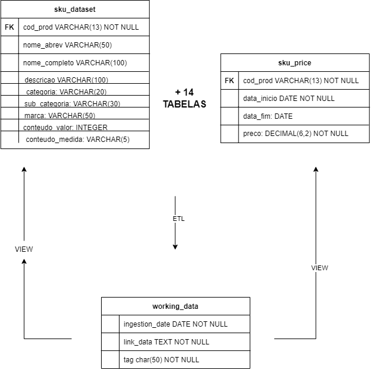
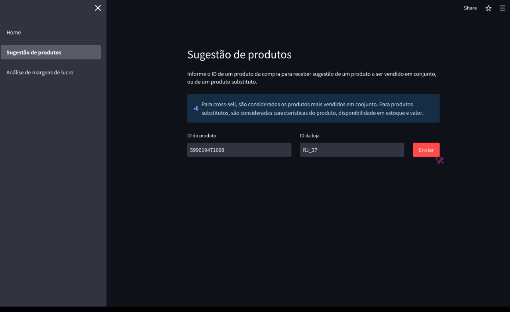
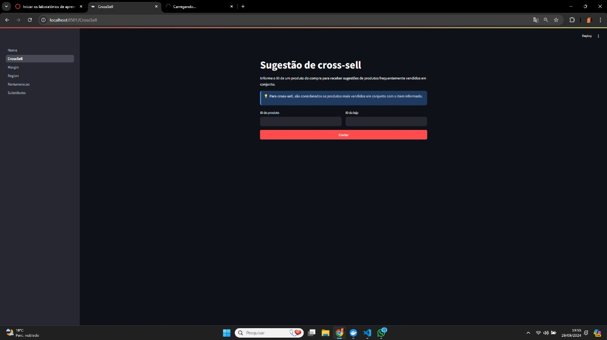
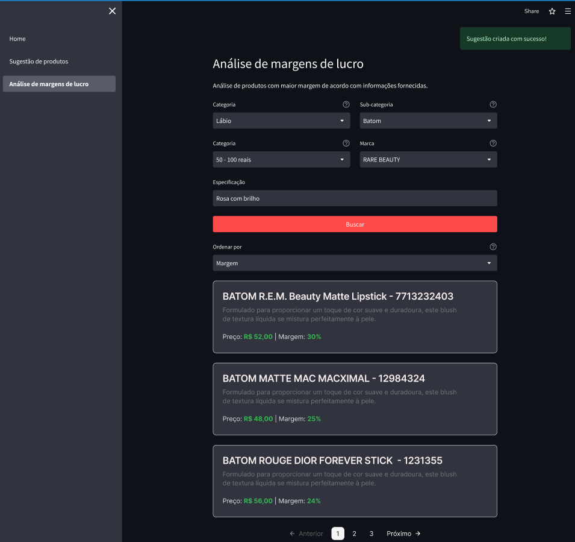
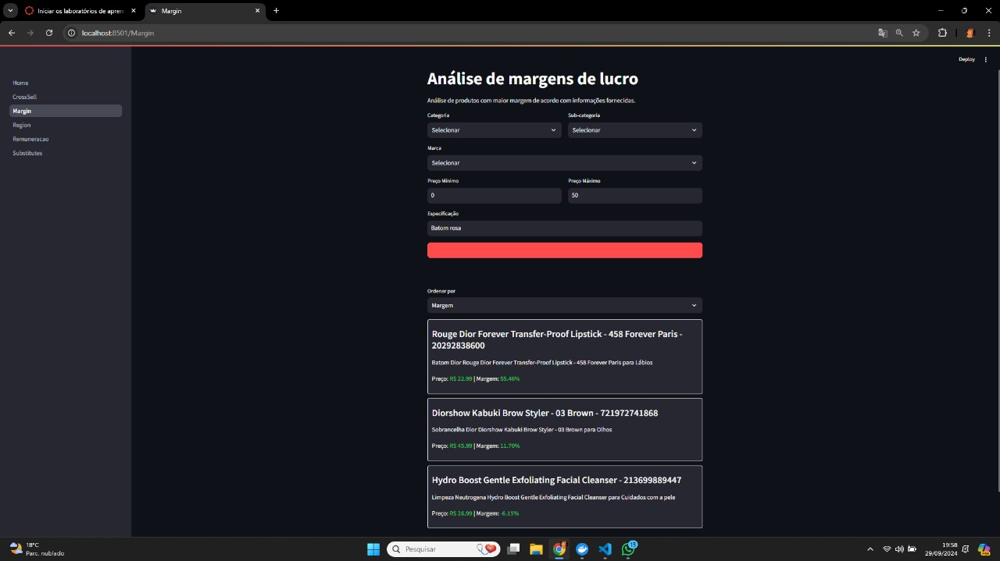
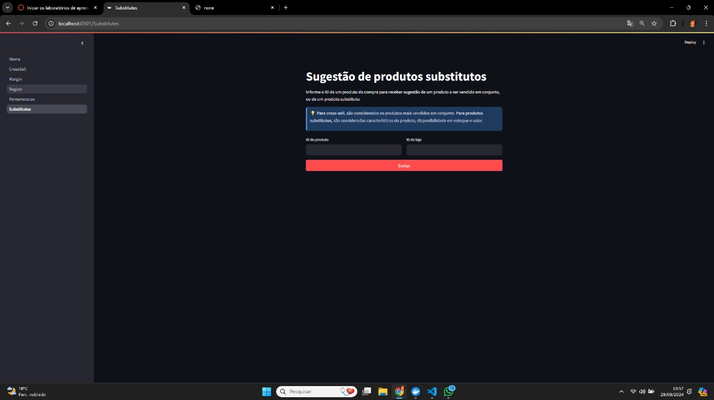

# Governança de Dados

### Índice
1. [Introdução](#1-introdução)
   - 1.1 [Contexto](#11-contexto)
   - 1.2 [Contexto do problema](#12-contexto-do-problema)
   - 1.3 [Escopo macro da solução](#13-escopo-macro-da-solução)
   - 1.4 [LGPD](#14-lgpd)
      - 1.4.1 [Conformidade com a LGPD no projeto](#141-conformidade-com-a-lgpd-no-projeto)
   - 1.5 [Impacto na eficiência operacional](#15-impacto-do-documento-na-eficiência-operacional)
   
   
2. [Requisitos e User Stories](#2-requisitos-e-user-stories)

3. [Príncipios](#3-princípios)

4. [Definições, Acrônimos e Abreviações](#4-definições-acrônimos-e-abreviações)

5. [Estrutura organizacional](#5-estrutura-organizacional)
   - 5.1 [Comitê de governança de dados](#51-comitê-de-governança-de-dados)
   - 5.2 [Papéis e responsabilidades](#52-papéis-e-responsabilidades)

6. [Políticas de dados](#6-políticas-de-dados)
   - 6.1 [Classificação dos dados](#61-classificação-dos-dados)
   - 6.2 [Métrica de qualidade dos dados](#62-métricas-de-qualidade-dos-dados)
   - 6.3 [Definição e modelagem dos processos de qualidade](#63-definição-e-modelagem-dos-processos-de-qualidade)
   - 6.4 [Privacidade dos dados](#64-privacidade-dos-dados)
   - 6.5 [Níveis de acesso aos dados](#65-níveis-de-acesso-aos-dados)
   - 6.6 [Segurança dos dados](#66-segurança-dos-dados)

7. [Arquitetura](#7-arquitetura)
   - 7.1 [Visão geral da arquitetura](#71-visão-geral-da-arquitetura)
      - 7.1.2 [Consideração de arquitetura](#712-considerações-de-segurança)
      - 7.1.3 [Monitoramento e gerenciamento](#713-monitoramento-e-gerenciamento)
      - 7.1.4 [Integridade de dados](#714-integridade-dos-dados)
   - 7.2 [Arquitetura do sistema - Versão 2](#72-arquitetura-do-sistema-versao-2)
   - 7.3 [Padrões e decisões arquiteturais](#73-padrões-e-decisões-arquiteturais)
   - 7.4 [Integração e interoperabilidade](#74-integração-e-interoperabilidade)

8. [Análise dos dados](#8-análise-dos-dados)
   - 8.1 [Medição da qualidade dos dados](#81-medição-da-qualidade-dos-dados)
   - 8.2 [Métodos de segurança](#82-métodos-de-segurança)
   - 8.3 [Escalabilidade e desempenho](#83-escalabilidade-e-desempenho)
   - 8.4 [Gestão de configuração e versionamento](#84-gestão-de-configuração-e-versionamento)
   - 8.5 [Auditoria e monitoramento do sistema](#85-auditoria-e-monitoramento-do-sistema)
   - 8.6 [Interface e usabilidade](#86-interface-e-usabilidade)
   - 8.7 [Plano de tarefas para testes de usabilidade](#87-plano-de-tarefas-para-testes-de-usabilidade)
   - 8.8 [Plano de Implementação](#88-plano-de-implementação)
      - 8.8.1 [Ferramentas utilizadas](#881-ferramentas-utilizadas)
      - 8.8.2 [Features desenvolvidas](#882-features-desenvolvidas)
      - 8.8.3 [Plano de implementação](#883-plano-de-implementação)
      - 8.8.4 [Testes](#884-testes)
      - 8.8.5 [Adicionando novos datasets](#885-adicionando-novos-datasets)
   - 8.9 [Relevância dos requisitos e especificações levantados pelo Wireframe](#89-relevância-dos-requisitos-e-especificações-levantados-pelo-wireframe)
   - 8.10 [Manutenção e evolução](#810-manutenção-e-evolução)
      - 8.10.1 [Melhorias de monitoramento](#8101-melhorias-de-monitoramento)
      - 8.10.2 [Melhorias de governança de dados](#8102-melhorias-de-governança-de-dados)
      - 8.10.3 [Melhorias de segurança](#8103-melhorias-de-segurança)
      - 8.10.4 [Melhorias de escalabilidade](#8104-melhorias-de-escalabilidade)
      - 8.10.5 [Melhorias de usabilidade/features](#8105-melhorias-de-usabilidade-/features)
9. [Processos de governança](#9-processos-de-governança)
   - 9.1 [Coleta de dados](#91-coleta-de-dados)
   - 9.2 [Armazenamento dos dados](#92-armazenamento-dos-dados)
   - 9.3 [Uso dos dados](#93-uso-dos-dados)
   - 9.4 [Compartilhamento dos dados](#94-compartilhamento-dos-dados)
   - 9.5 [Descarte dos dados](#95-descarte-dos-dados)
   - 9.6 [Treinamento e cultura de governança](#96-treinamento-e-cultura-de-governança)
   - 9.7 [Contribuição para a cultura de privacidade](#97-contribuição-para-a-cultura-de-privacidade)

10. [Revisão e melhoria contínua](#10-revisão-e-melhoria-contínua)
   - 10.1 [Processo de revisão](#101-processo-de-revisão)
   - 10.2 [Plano de melhoria](#102-plano-de-melhoria)

11. [Governança de dados e LGPD alinhadas aos objetivos estratégicos da organização](#11-governança-de-dados-e-lgpd-alinhadas-aos-objetivos-estratégicos-da-organização)
   - 11.1 [Alinhamento com metas de negócio](#111-alinhamento-com-metas-de-negócio)
   - 11.2 [Melhoria da performance operacional e rentabilidade](#112-melhoria-da-performance-operacional-e-rentabilidade).
   - 11.3 [Gerenciamento de remuneração e desempenho](#113-gerenciamento-de-remuneração-e-desempenho)
   - 11.4 [Recomendações de produtos e aumento de vendas](#114-recomendações-de-produtos-e-aumento-de-vendas)

12. [Conformidades com LGPD](#12-conformidades-com-lgpd)
   - 12.1 [Princípios da LGPD no projeto](#121-princípios-da-lgpd-no-projeto)
   - 12.2 [Processos de governança de dados para garantir qualidade](#122-processos-de-governança-de-dados-para-garantir-qualidade)
   - 12.3 [Conclusão](#123-conclusão)

13. [Convenção PEP 8](#13-convenção-pep-8)
   - 13.1 [Controle de versão](#131-controle-de-versão)

14. [Referências](#14-referências)
   - 14.1 [Documentos de Referência](#141-documentos-de-referência)
   - 14.2 [Referências Bibliográficas](#142-referências-bibliográficas)

### 1. Introdução
A criação de uma governança de dados visa estabelecer uma estrutura robusta para garantir a integridade, segurança e utilização eficaz dos dados dentro do projeto. Ela é fundamental para identificar oportunidades de negócios, otimizar processos e assegurar a conformidade regulatória, permitindo que a organização tome decisões informadas com base em dados confiáveis.

#### 1.1 Contexto 
O projeto apresentado pelo parceiro envolve dados que incluem informações sensíveis, como dados pessoais de funcionários e informações estratégicas relacionadas a vendas e projeções para o futuro. A gestão e proteção desses dados exigem uma abordagem cuidadosa e rigorosa, não apenas pela importância estratégica que eles representam para a empresa, mas também em cumprimento às exigências estabelecidas pela Lei Geral de Proteção de Dados.

### 1.2 Contexto do problema
A empresa parceira traz o caso de um cliente, CosmeticCo, uma grande varejista de cosméticos brasileira. A comunicação inadequada entre o setor corporativo da empresa e as lojas (incluindo gerentes e vendedores), especialmente em relação aos complexos modelos de remuneração variável, tem levado a um alto índice de rotatividade, baixo engajamento dos vendedores e desempenho inferior ao esperado. 

### 1.3 Escopo macro da solução
A solução irá abordar uma pipeline com políticas de governança de dados, sendo o resultado final um sistema que permita a visualização de informações hiper personalizadas dos dados dos vendedores e gerentes. 

#### 1.4 LGPD
A Lei Geral de Proteção de Dados (LGPD) surgiu em um contexto global de crescente preocupação com a privacidade e a segurança dos dados pessoais. O avanço da tecnologia, especialmente com o surgimento da Internet e das redes sociais, trouxe consigo a capacidade de coletar, armazenar e processar grandes volumes de dados sobre indivíduos. Isso gerou uma necessidade urgente de regulamentação para proteger os direitos dos cidadãos em relação ao uso de suas informações pessoais.

Uma das grandes influências da LGPD foi o Regulamento Geral sobre a Proteção de Dados (GDPR), uma legislação da União Europeia que entrou em vigor em maio de 2018. Foi o responsável por estabelecer um novo padrão global para a proteção de dados, impondo regras rigorosas para o tratamento de informações pessoais e aplicando multas para as organizações que violassem essas regras. A criação da LGPD foi, portanto, uma resposta do Brasil para alinhar-se a essas novas exigências globais, além de proteger a privacidade dos seus cidadãos em um contexto onde o mundo se torna mais conectado a cada dia.

##### 1.4.1 Conformidade com a LGPD no projeto
A conformidade com a Lei Geral de Proteção de Dados (LGPD) pode ser avaliada em função de vários princípios fundamentais da lei. Abaixo estão alguns princípios e como estamos atendendo eles no projeto:

###### 1. Finalidade (Art. 6º, I)
O princípio da finalidade garante que o tratamento de dados deve ter propósitos legítimos, específicos e explícitos, informados ao titular dos dados. O projeto lida com dados para gerar insights de vendas para as lojas, o que pode ser considerado um propósito legítimo, e os donos desses dados (coloboradores da empresa) estão cientes de como seus dados estão sendo utilizados.

###### 2. Adequação (Art. 6º, II)
Os dados coletados devem ser adequados e compatíveis com as finalidades informadas. No projeto, a coleta de dados sobre transações, remunerações e sugestões deve estar alinhada com a finalidade de melhorar o desempenho da loja e sugerir melhorias. 

###### 3. Necessidade (Art. 6º, III)
Apenas os dados estritamente necessários para alcançar os objetivos da coleta devem ser tratados. Isso pode ser um ponto crítico, pois é importante que a solução não colete dados excessivos ou desnecessários.

###### 4. Segurança (Art. 6º, VII)
A segurança dos dados deve ser garantida por meio de medidas técnicas e administrativas apropriadas. O projeto adere a esse princípio através da implementação de autenticação de acesso e uso de ferramentas como Elasticsearch e Kibana para monitoramento de logs, o que gera um nível de rastreabilidade e controle sobre o que ocorre no sistema.

###### 5. Responsabilização e prestação de contas (Art. 6º, X)
A documentação adequada e o monitoramento contínuo por meio de logs  demonstram a conformidade com a LGPD, o que é essencial para prestar contas, caso necessário. O sistema também é capaz de manter um histórico detalhado de acesso e alterações nos dados, o que ajuda a reforçar esse princípio.

---

###### Como a solução e a documentação atendem os princípios

A autenticação, o monitoramento com Elasticsearch, Kibana e o foco na documentação são boas práticas que atendem tanto à LGPD quanto a outras regulamentações, principalmente nos seguintes pontos:

- **Documentação e rastreabilidade**: O uso de logs detalhados ajuda a demonstrar o controle e a segurança do sistema, o que é essencial para a prestação de contas.
  
- **Segurança dos dados**: A autenticação e a capacidade de auditar as atividades no sistema são medidas de segurança fundamentais que ajudam a proteger os dados pessoais contra acesso não autorizado.

- **Transparência**: A documentação clara e a rastreabilidade das operações no sistema contribuem para a transparência das operações, outro ponto importante nas regulamentações de proteção de dados.

#### 1.5 Impacto do documento na eficiência operacional
Desde a Sprint 1, a documentação de gestão e governança de dados foi estruturada para garantir consistência, alinhamento e eficiência ao longo de todo o ciclo de vida do projeto. Essa estrutura abrange desde o levantamento de requisitos e a definição de papéis e responsabilidades até a padronização de políticas de dados e processos arquiteturais. Com isso, é possível minimizar redundâncias e retrabalho, garantindo que todos os envolvidos compartilhem uma visão comum e sigam as mesmas diretrizes, o que facilita a colaboração e a resolução de problemas.
Os itens documentados pelo grupo não apenas organizam e normatizam práticas, mas também promovem uma maior qualidade de dados e transparência. Cada componente da documentação contribui de forma estratégica, como a criação de políticas claras para classificação e segurança dos dados, que reduzem a duplicidade de processos e asseguram que todas as equipes utilizem os dados de forma padronizada. Além disso, a documentação detalhada da arquitetura, dos padrões e das decisões arquiteturais oferece um referencial técnico sólido para todos os leitores. Isso evita abordagens divergentes e reduz inconsistências que poderiam surgir se cada sprint fosse conduzida de maneira independente.
Ao longo de cada sprint, o conteúdo relacionado aos processos de governança foi ampliado e revisado continuamente, permitindo que os processos fossem otimizados à medida que novas lições eram aprendidas e novas necessidades emergiam. Manter uma documentação detalhada e organizada durante todo o desenvolvimento promove agilidade, pois diminui o tempo gasto com esclarecimentos e minimiza os riscos de inconsistências. Essa documentação centraliza informações essenciais e facilita a adaptação a novas demandas e mudanças no escopo, garantindo que todos os requisitos e diretrizes estejam bem descritos e contextualizados.
Além disso, o valor entregue por meio dessa documentação reflete-se na capacidade da equipe de responder rapidamente a novos requisitos e ajustes, sem comprometer a integridade do projeto. Isso, portanto, promove um ciclo de desenvolvimento mais ágil e eficiente, onde o foco principal permanece na entrega contínua de valor ao usuário e na manutenção da qualidade dos dados gerenciados.
Em conclusão, este documento foi fundamental para o desenvolvimento do Vizion Data App, proporcionando maior eficiência no gerenciamento do tempo e no desenvolvimento dos requisitos, arquitetura, funcionalidades, análises e código ao longo das 10 semanas do projeto. Ele serviu como uma base sólida que orientou a equipe, garantindo consistência e qualidade em todas as etapas do desenvolvimento, sejam elas requisitos, arquiteturas, features, prototipações, análises ou código.

### 2. Requisitos e User Stories
#### 2.1 Requisitos Funcionais

Requisitos funcionais descrevem o comportamento do sistema e as funcionalidades que o sistema deve ter para atender às necessidades dos usuários. Eles definem o que o sistema deve fazer para cumprir as expectativas dos usuários e são essenciais para o desenvolvimento de software. Dessa forma, 

**RF001 -** O pipeline deve realizar a limpeza e o processamento dos dados em um fluxo de ETL (Extract, Transform, Load) com camadas bem modularizadas

**RF002 -**  Os dados processados devem ser estruturados de forma a estarem prontos para consumo em funcionalidades específicas do data app

**RF003 -** Todos os dados pessoais devem ser criptografados durante o processamento e armazenamento

**RF004 -** O data app deve fornecer projeções de vendas e remuneração para vendedores e gerentes de loja no mês corrente

**RF005 -** O data app deve fornecer recomendações de produtos que são frequentemente vendidos juntos (cross-sell) e de produtos substitutos

**RF006 -** O data app deve permitir a comparação entre vendedores da mesma loja.

**RF007 -** O data app deve exibir uma estratégia de como apresentar os produtos com as maiores margens de lucro

**RF008 -** O data app deve ranquear as melhores lojas no mês corrente com base em métricas de desempenho

#### 2.2 Requisitos Não Funcionais

Requisitos não funcionais são os requisitos relacionados ao uso da aplicação em termos de desempenho, usabilidade, confiabilidade, segurança, disponibilidade, manutenibilidade e tecnologias envolvidas. Eles especificam as qualidades e restrições que o sistema deve possuir, definindo os atributos de qualidade do software

**RNF001 -** O pipeline de dados deve ser escalável, capaz de lidar com um volume crescente de dados sem degradação significativa do desempenho

**RNF002 -** O pipeline deve oferecer bom desempenho, garantindo que os dados sejam processados de maneira eficiente e dentro dos prazos necessários para a aplicação

**RNF003 -**  A criptografia de dados pessoais deve garantir a proteção das informações sensíveis, tanto em repouso quanto em trânsito

**RNF004 -**  As camadas do pipeline devem ser bem modularizadas, permitindo fácil manutenção, atualização e extensão do sistema

**RNF005 -** O data app deve ser compatível com plataformas mobile e web, garantindo uma experiência de usuário consistente em diferentes dispositivos.

#### 2.3 User Stories

User stories são descrições curtas que capturam as necessidades e desejos de um usuário final em um projeto de desenvolvimento de software. Elas servem como um lembrete do que deve ser feito, permitindo que os desenvolvedores compreendam claramente o que o usuário final espera obter com o produto ou funcionalidade. Além disso, elas ajudam a manter o foco no valor entregue ao usuário, facilitando a priorização das tarefas e o alinhamento com os objetivos do projeto.

1. Eu, **como usuário do sistema**, **quero** abrir o site e ter acesso direto à visualização dos dados, sem precisar passar por uma home page, para que eu possa acessar rapidamente as informações de que preciso;

2. Eu, **como usuário do sistema**, **quero** filtrar somente os dados que me interessam, para que eu tenha uma visualização clara e focada nas informações que são relevantes para mim;

3. Eu, **como gerente da loja**, **quero** visualizar no DataApp, monitorar e comparar o desempenho de cada funcionário,  para identificar oportunidades de melhoria e premiar os melhores desempenhos e, assim, tomar decisões para identificar oportunidades de melhoria e premiar os melhores desempenhos; 

4. Eu, **como gerente da loja**, **quero** visualizar o total de vendas de outras lojas da mesma região que a minha, para que eu possa entender se conseguirei receber um acréscimo de 2 mil reais no meu salário;

5. Eu, **como vendedor da loja**, não **quero** que outras pessoas acessem as informações sobre minhas vendas, para que minha privacidade seja garantida; 

6. Eu, **como vendedor da loja**, desejo verificar quanto falta para bater minha meta do mês, para que eu possa acompanhar  meu desempenho;

7. Eu, **como engenheiro de dados**, **quero** que o pipeline realize a limpeza e o processamento dos dados em um fluxo de ETL com camadas bem modularizadas, para que os dados sejam organizados de maneira eficiente e estejam prontos para uso em futuras análises;

8. Eu, **como analista de dados**, **quero** que os dados processados sejam estruturados e prontos para consumo no DataApp, para que eu possa facilmente gerar relatórios e análises específicas para vendedores e gerentes;

9. Eu, **como engenheiro de segurança**, **quero** que todos os dados pessoais sejam criptografados durante o processamento e armazenamento, para que as informações sensíveis dos vendedores e gerentes sejam protegidas;

10. Eu, **como vendedor**, **quero** receber recomendações de produtos que são frequentemente vendidos juntos ou que são substitutos, para que eu possa aumentar as minhas vendas por meio de cross-sell e upsell;

11. Eu, **como gerente de loja**, **quero** visualizar produtos com as maiores margens de lucro, para que eu possa maximizar o lucro da minha loja;

12. Eu, **como engenheiro de dados**, **quero** que o pipeline de dados seja escalável, para que ele possa lidar com um volume crescente de dados sem degradação significativa do desempenho;

13. Eu, **como engenheiro de software**, **quero** que o DataApp seja compatível com plataformas mobile e web, para que os usuários possam acessar as informações em diferentes dispositivos com uma experiência consistente;

14. Eu, **como diretor de operações**, **quero** visualizar um dashboard com insights de vendas e performance de todas as lojas, para que eu possa tomar decisões estratégicas baseadas em dados.

### 3. Princípios
A governança de dados na CosmeticCo será regida por uma série de princípios fundamentais, cada um com práticas específicas para enfrentar os desafios identificados na comunicação entre o setor corporativo e as lojas. A transparência será alcançada através da criação de um pipeline de dados que documenta e monitora cada etapa do ciclo de vida das informações, desde a coleta até a visualização. Isso garantirá que gerentes e vendedores tenham acesso a informações claras e precisas e, consequentemente, aumentando seu desempenho.

A responsabilidade será assegurada pela definição clara de papéis no processo de governança para todos os alunos desenvolvedores do projeto, onde cada parte, tem o dever e pontos de contato definidos, facilitando a comunicação e resolução de problemas. A integridade dos dados será mantida por meio do processo de ETL, com mecanismos de validação que garantem que os dados sobre os gestores e vendedores estejam consistentes.

A confidencialidade dos dados, especialmente informações sensíveis sobre remuneração e desempenho, será protegida com o uso de políticas de acesso restrito e criptografia. Cada nível de usuário terá apenas acesso aos dados em que é autorizado, o que fortalecerá a confiança entre gerentes e vendedores ao lidar com informações pessoais e de negócios. Finalmente, o compliance será garantido pela aderência a leis e regulamentos, como a LGPD.

### 4. Definições, Acrônimos e Abreviações
**GDPR:** General Data Protection Regulation, regulamento europeu de proteção de dados.
**LGPD:** Lei Geral de Proteção de Dados, legislação brasileira sobre privacidade e proteção de dados pessoais.
**Data Lake:** Armazenamento centralizado que permite armazenar dados estruturados e não estruturados em grande volume.
**DGC:** Data Governance Committee ou Comitê de Governança de Dados, grupo responsável pela supervisão da governança de dados na organização.
**ETL:** Extract, transform, load ou extrair, transformar e carregar.

### 5. Estrutura organizacional
#### 5.1 Comitê de governança de dados
Normalmente, em organizações, há um Comitê de Governança de Dados (DGC) que é composto por representantes das principais áreas de negócio, TI, jurídico e compliance. O comitê é responsável por revisar e aprovar políticas de dados, monitorar a conformidade e assegurar a implementação das melhores práticas de governança. Neste projeto, o comitê se dará pelos 7 (sete) integrantes do grupo Vizion.

#### 5.2 Papéis e responsabilidades
Os principais papéis de uma estrutura organizacional de governança de dados são o Data Owner, que é responsável pelos dados dentro de uma área específica da organização, o Data Steward que é responsável por garantir a qualidade e conformidade dos dados, o Data Custodian, responsável pelo armazenamento e proteção técnica dos dados e os datas users, que são os profissionais que utilizam os dados para tomar decisões e executar tarefas operacionais. No contexto deste projeto, em um ambiente acadêmico, os integrantes do grupo rotacionarão os papéis descritos.

### 6. Políticas de dados
#### 6.1 Classificação dos dados
Os dados serão classificados em categorias com base em sua sensibilidade e importância para a organização: internos para diretoria, internos para vendedores, internos para gerentes, confidenciais e críticos.

#### 6.2 Métricas de qualidade dos dados
1. **Completude dos dados**:
    - **Descrição**: avalia se todos os campos obrigatórios estão preenchidos.
    - **Métrica**: percentual de registros com todos os campos obrigatórios preenchidos.
    - **Fórmula**: (Número de registros completos / Número total de registros) * 100%.
        - Número de registros completos: refere-se ao número de registros que possuem todos os campos obrigatórios preenchidos
        - Número total de registros: refere-se ao número de registros total, incluindo os que faltam informações nos campos.
        - **Obtenção do número de registros completos**: verificação de cada registro para garantir que todos os campos obrigatórios estejam preenchidos (sem valores nulos ou vazios) e contagem de quantos registros estão completos.
2. **Consistência dos dados**:
    - **Descrição**: mede se os dados são consistentes entre diferentes bases de dados ou de uma mesma base.
    - **Métrica**: percentual de registros quão mantêm a solidez entre fontes de dados.
    - **Fórmula**: (Número de registros consistentes / Número integral de registros) * 100%
        - Número de registros consistentes: refere-se ao número de registros que mantêm consistência entre diferentes bases de dados ou dentro de uma mesma base. Por exemplo, se um vendedor aparece com diferentes IDs em uma tabela RAW e uma mais tratada, existe consistência entre os dados.
        - **Obtenção do número de registros consistentes:** comparação dos registros entre diferentes tabelas ou dentro de uma mesma tabela e identificação de divergências.
3. **Validade dos dados**:
    - **Descrição**: verifica se os dados seguem regras de negócios definidas (por exemplo, forma de data, princípios permitidos).
    - **Métrica**: percentual de registros quão estão conforme com as regras de validação.
    - **Fórmula**: (Número de registros válidos / Número integral de registros) * 100%.
        - Número de registros válidos: refere-se ao número de registros que estão em conformidade com as regras de validação de dados, como formato correto de data, valores dentro de intervalos esperados, etc.
        - Exemplo: formatação e padronização de datas, nomes de colunas de mesmo significado em diferentes tabelas, valores numéricos dentro de limites, etc.
        - **Obtenção no número de registros válidos:** Regras de validação nos campos relevantes (ex: datas, valores numéricos) e contagem de quantos registros passam em todas as validações.
4. **Integridade dos dados**:
    - **Descrição**: avalia se as correspondências entre os dados estão intactas e corretas.
    - **Métrica**: percentual de correspondência corretamente mantidas.
    - **Fórmula**: (Número de corespondências íntegras / Número integral de respondência) * 100%.
        - Refere-se ao número de registros onde as relações de integridade referencial estão corretas.
        - Por exemplo, se você tem uma tabela de vendas que faz referência a uma tabela de produtos, cada registro de venda deve corresponder a um produto existente na tabela de produtos.
        - **Obtenção do número de correspondências íntegras:** pode ser obtida se todas as chaves estrangeiras nas tabelas possuem correspondência válida na tabela referenciada, contando a quantidade de correspondências íntegras(com relação válida).
5. **Auditabilidade dos dados**:
    - **Descrição**: verifica se os dados possuem rastreabilidade, permitindo a ouvidoria de mudanças e operações realizadas.
    - **Métrica**: percentual de dados com histórico de alterações disponível.
    - **Fórmula**: (Número de registros auditáveis / Número integral de registros) * 100%.
        - Refere-se ao número de registros que têm rastreabilidade de alterações, permitindo que você veja quem alterou o registro, quando e o que foi alterado.
        - **Obtenção de número de registros auditáveis:** contagem do número de registros que possuem logs de alteração ou histórico de versão que permita a auditoria, ou seja, com uma tabela de logs ou uma coluna de "última modificação por", é possível usar essas informações para determinar a auditabilidade.

#### 6.3 Definição e modelagem dos processos de qualidade
1. **Completude dos dados**
- **Definição do processo**: criação de verificações automáticas que assegurem que todos os campos obrigatórios estejam preenchidos. Isso pode ser feito utilizando scripts que varrem a base de dados para identificar registros incompletos.
- **Modelagem**: implementar regras de negócio que validem a completude durante a inserção ou atualização dos dados. Relatórios periódicos de dados incompletos podem ser gerados para ação corretiva.

2. **Consistência dos dados**
- **Definição do processo**: implementação de checks que garantem que os dados são consistentes tanto dentro de uma base de dados quanto entre diferentes bases.
- **Modelagem**: uso de mecanismos de sincronização de dados e verificações cruzadas entre bases de dados para garantir consistência. Regras de normalização podem ser aplicadas para evitar redundâncias e inconsistências.

3. **Validade dos dados**
- **Definição do processo**: aplicação de regras de validação que asseguram que os dados seguem os padrões estabelecidos (ex.: formato de datas, valores dentro de intervalos permitidos).
- **Modelagem**: criação de scripts que validam os dados na inserção, atualização e em intervalos regulares. Os dados que não atenderem às regras de validação são sinalizados para revisão ou correção.

4. **Integridade dos dados**
- **Definição do processo**: verificações de integridade referencial entre tabelas para garantir que as chaves estrangeiras estão corretamente associadas.
- **Modelagem**: implementação de restrições de integridade no banco de dados e processos de validação que identificam e corrigem problemas de integridade, como registros órfãos.

5. **Auditabilidade dos dados**
- **Definição do processo**: implementação de logs de alteração que registram quem, quando e o que foi alterado em cada registro.
- **Modelagem**: configuração de sistemas de auditoria, como tabelas de logs ou versionamento de dados, que permitem rastrear todas as alterações realizadas nos registros ao longo do tempo.

#### 6.4 Privacidade dos dados
A privacidade dos dados pessoais será protegida em conformidade com as leis de privacidade aplicáveis, como a LGPD. Coletaremos e manteremos apenas os dados necessários, e, sempre que possível, os dados pessoais serão anonimizados e criptografados para proteger a identidade dos indivíduos. O consentimento para o uso dos dados será gerenciado de forma clara e transparente, permitindo que os titulares saibam como seus dados serão utilizados.

#### 6.5 Níveis de acesso aos dados
O acesso aos dados sensíveis será controlado através de uma classificação dos dados por nível de sensibilidade, com políticas de acesso adequadas para cada nível. A hierarquia de acesso será estabelecida com base na necessidade de conhecimento, garantindo que apenas níveis autorizados tenham acesso às informações mais sensíveis.

#### 6.6 Segurança dos dados
A segurança dos dados será garantida por meio de controles de acesso, onde o acesso aos dados será restrito de acordo com as funções e responsabilidades dos colaboradores. Além disso, os dados estarão hospedados em um ambiente privado da cloud escolhida pelo grupo.

### 7. Arquitetura

#### 7.1 Visão geral da arquitetura
 
Uma visão geral da arquitetura serve para fornecer uma compreensão clara e simplificada de como os diferentes componentes de um sistema ou projeto se conectam e interagem entre si. Ela ajuda a identificar o fluxo de dados, os principais processos envolvidos, os pontos de integração entre sistemas e as tecnologias utilizadas. Nesse sentido, abaixo, apresento uma versão (que pode sofrer alterações) da arquitetura de dados e informação do nosso projeto.

.png)

<a href="https://drive.google.com/file/d/10JP9oNgObCI3W-n3-55B0GlqU0SdTODs/view?usp=sharing">Link para o Draw.io </a>

##### Elementos da arquitetura

- Amazon S3 (Camada bronze): Armazenamento inicial dos dados brutos. Aqui, os dados são armazenados sem transformação, representando a "Camada Bronze" do pipeline de dados.

- Python (Processamento e transformação): Os dados brutos do S3 são extraídos e transformados por scripts Python, que fazem parte do processo ETL (Extração, Transformação e Carga). Esta etapa representa o movimento dos dados da camada Bronze para a "Camada Silver".

- ClickHouse (Armazenamento e procedures): O ClickHouse é utilizado como um banco de dados de alto desempenho para armazenamento e processamento de dados transformados. Os dados chegam à "Camada Silver" e são organizados em tabelas intermediárias.
Procedures e Views SQL: No ClickHouse, são criadas views para consultas rápidas e eficientes, oferecendo dados prontos para análise. Esta etapa corresponde à "Camada Gold".

Streamlit (Dashboard): Um aplicativo de dashboard construído com Streamlit para visualizar os dados de maneira interativa e amigável. Ele consome os dados diretamente das views SQL no ClickHouse.

- Amazon CloudWatch (Monitoramento): Monitoramento de logs e métricas do ClickHouse na Amazon EC2, o que ajuda a garantir a operação estável e eficiente do pipeline.

##### Relacionamento e descrição de cada elemento da arquitetura

A. Amazon S3

O Amazon S3 é utilizado como o repositório inicial de dados brutos, conhecido como a "Camada Bronze" no pipeline de dados. Neste estágio, todos os dados coletados de diversas fontes são armazenados de forma íntegra e sem qualquer tipo de transformação ou processamento.

A utilização do S3 oferece uma solução escalável e segura para armazenamento de dados, permitindo que grandes volumes de informações sejam mantidos de maneira eficiente. Além disso, o S3 suporta diversos formatos de arquivos (como CSV, JSON, Parquet), oferecendo flexibilidade na ingestão de dados. Os scripts Python são responsáveis por acessar esses dados diretamente do S3 para iniciar o processo de ETL (Extração, Transformação e Carga).

B. Python

Os scripts Python atuam na execução do processo de ETL, transformando dados brutos da "Camada Bronze" em informações mais estruturadas para análise na "Camada Silver". Eles realizam as seguintes etapas:

- Extração (E): Os scripts conectam-se ao Amazon S3 para ler e baixar os dados brutos necessários. Utilizam bibliotecas como boto3 para interagir com o S3, garantindo uma transferência de dados segura e eficiente.

- Transformação (T): Os dados extraídos são processados e transformados utilizando bibliotecas como Pandas e PyArrow. Durante esta fase, os dados são limpos, normalizados e formatados conforme necessário. Por exemplo, arquivos CSV são convertidos em formatos Parquet mais otimizados para análises posteriores.

- Carga (L): Após a transformação, os dados são carregados no ClickHouse, um banco de dados de alta performance, para armazenamento e consultas rápidas. Esse processo garante que os dados estejam preparados para consultas eficientes e análises avançadas.

C. ClickHouse

O ClickHouse é utilizado como a principal solução de armazenamento de dados processados na arquitetura, representando a "Camada Silver". Ele foi escolhido por ser um sistema de gerenciamento de banco de dados colunar altamente otimizado para consultas analíticas e operações de leitura intensiva, oferecendo excelente desempenho em grandes volumes de dados.

Armazenamento de dados processados: Os dados transformados são armazenados em tabelas do ClickHouse, como a `working_data`. Essa tabela contém colunas essenciais como `ingestion_date` (data de ingestão dos dados), `line_data` (dados em formato JSON) e `tag` (indicador de tipo de dado).

Criação de views: A partir dessas tabelas, são criadas views, como `cost_view` e `price_view`, para facilitar as consultas de dados específicos (como custos e preços de produtos). As views permitem uma recuperação rápida de informações otimizadas, mantendo a flexibilidade para filtrar e organizar os dados de acordo com a necessidade do negócio.

D. Streamlit

O Streamlit é a interface de visualização dos dados processados, proporcionando uma plataforma interativa para explorar e analisar dados de maneira intuitiva. Ele utiliza dados provenientes diretamente das views SQL no ClickHouse e apresenta esses dados de forma amigável para o usuário, através de dashboards.

Painéis interativos: Os dashboards são construídos para permitir que usuários filtrem, analisem e visualizem dados de maneira interativa. Eles utilizam funcionalidades como gráficos de linha para mostrar a evolução de custos e preços ao longo do tempo, e tabelas dinâmicas para exibir dados filtrados conforme a necessidade do usuário.

Exploração intuitiva de dados: Streamlit permite uma análise visual fácil e direta, ajudando os usuários a descobrir padrões, tendências, e insights sem a necessidade de habilidades avançadas de análise de dados

E. Amazon CloudWatch

O Amazon CloudWatch será utilizado para monitorar o desempenho e a saúde do ClickHouse hospedado em uma instância EC2. Embora ainda não esteja implementado, o CloudWatch oferece diversos benefícios cruciais para o monitoramento e gerenciamento de operações:

Monitoramento de recursos: CloudWatch monitorará métricas importantes do ClickHouse, como uso de CPU, memória, latência de consultas e operações de leitura/gravação. Esse monitoramento contínuo ajuda a garantir que o sistema funcione de maneira otimizada e evita gargalos de desempenho.

Análise de logs: Os logs do ClickHouse, incluindo informações sobre falhas de consulta, tempo de execução, e erros, serão enviados ao CloudWatch para análise, o que facilitará a identificação de problemas, permitindo correções rápidas e eficazes.

Alertas e notificações: CloudWatch permite configurar alarmes que notificam a equipe responsável sempre que uma métrica excede um limite pré-definido (ex. uso excessivo de CPU ou falhas repetidas de consultas), fazendo com que a equipe esteja ciente de problemas em tempo real e possa agir proativamente para mitigar riscos.

#### 7.1.2 Considerações de segurança

##### Pontos identificados

###### Segurança dos dados em trânsito:

Para garantir a proteção dos dados durante a transferência entre diferentes componentes da arquitetura (como Amazon S3, ClickHouse e Streamlit), é essencial usar HTTPS para criptografar todos os dados trafegando na rede. Isso impede que os dados sejam interceptados ou modificados por terceiros mal-intencionados durante o transporte, garantindo sua confidencialidade e integridade. O uso de HTTPS (HTTP sobre TLS/SSL) protege tanto as requisições quanto as respostas entre o cliente e o servidor, evitando ataques como o "Man-in-the-Middle" (MitM). Além disso, ao configurar o acesso a serviços como o S3 e a instância EC2 do ClickHouse, é necessário garantir que todas as chamadas API e transferências de dados utilizem endereços HTTPS.

###### Segurança de acesso ao ClickHouse:

No ClickHouse, a segurança de acesso é gerenciada por meio de um arquivo de configuração (`clickhouse-users.xml`). Este arquivo permite definir usuários, senhas e permissões específicas, garantindo que apenas indivíduos autorizados possam acessar, consultar ou modificar os dados armazenados. Por exemplo, podemos definir usuários com diferentes níveis de acesso: alguns podem apenas ler dados, enquanto outros podem executar queries complexas ou modificar a estrutura do banco de dados. A configuração adequada dos usuários e de suas permissões evita acessos não autorizados e minimiza os riscos de violações de segurança.

######  Credenciais seguras:

O uso do arquivo .env (gerenciado pela biblioteca `dotenv`) para armazenar credenciais sensíveis, como chaves de acesso AWS, senhas de banco de dados, e tokens de autenticação, é uma prática essencial para proteger informações confidenciais e evita a exposição de credenciais diretamente no código-fonte, que pode ser inadvertidamente compartilhado ou armazenado em repositórios públicos. O `.env` deve ser armazenado de forma segura e jamais incluído no controle de versão (ex.: Git). , que já é uma prática que estamos utilizando. As credenciais são carregadas dinamicamente apenas durante o tempo de execução do ambiente seguro.

##### Considerações estratégicas

###### Criptografia

Criptografia de dados em trânsito e em repouso: Implementar SSL/TLS para todas as comunicações entre componentes do sistema (Amazon S3, ClickHouse, Streamlit) para garantir que os dados estejam sempre protegidos durante o transporte. Além disso, é importante considerar a criptografia de dados "em repouso", especialmente para os dados armazenados no S3 e no ClickHouse, o que pode ser feito usando chaves de criptografia gerenciadas pela AWS (para S3) ou chaves de criptografia personalizadas, dependendo do nível de segurança exigido.

###### Controle de acesso

Políticas de controle de acesso baseadas em função (RBAC): Implementar um modelo de controle de acesso baseado em funções (RBAC) que limita o acesso aos recursos de dados com base na função do usuário. Por exemplo, usuários administrativos podem ter permissão para gerenciar configurações de segurança, enquanto os analistas de dados podem apenas ler dados e executar consultas. Esse modelo de controle de acesso deve ser aplicado em todos os níveis da arquitetura, incluindo o acesso aos dados no ClickHouse e ao código-fonte dos scripts Python.

Segurança de infraestrutura: Garantir que a infraestrutura, como a instância EC2 onde o ClickHouse está hospedado, tenha regras de firewall adequadas, restringindo o acesso somente a IPs autorizados e portas necessárias. Utilizar Grupos de segurança da AWS para definir essas políticas de acesso de forma rígida e monitorada.

#### Planos de ação

##### Revisão regular de segurança:

Auditorias periódicas de segurança: Realizar auditorias regulares para revisar as permissões de usuários, configurações de segurança, criptografia e práticas de armazenamento de credenciais. Essas auditorias devem incluir a análise de logs de acesso, revisão de políticas de controle de acesso, verificação de conformidade com padrões de segurança e atualização de credenciais regularmente. Um cronograma de auditoria trimestral ou semestral deve ser implementado, garantindo que a equipe de segurança revise todos os componentes críticos da arquitetura.

Teste de vulnerabilidade e penetração: Executar testes de penetração e varredura de vulnerabilidades periodicamente para identificar fraquezas na arquitetura de segurança e tomar medidas corretivas proativas antes que uma exploração maliciosa ocorra.

##### Monitoramento ativo

Monitoramento com Amazon CloudWatch: Utilizar esse serviço da AWS para configurar métricas e alarmes de segurança, como falhas de autenticação repetidas, picos anômalos de uso de recursos, e acessos não autorizados. Configurar alarmes específicos para atividades suspeitas ou anômalas, como tentativas de acesso de locais desconhecidos ou fora do horário de expediente. Além disso, configurar notificações automáticas para a equipe de segurança quando esses alarmes forem acionados, permitindo uma resposta rápida e coordenada a possíveis ameaças.

#### 7.1.3 Monitoramento e gerenciamento

##### Monitoramento de desempenho no ClickHouse

O Amazon CloudWatch será usado para monitorar métricas críticas de desempenho do ClickHouse hospedado na instância EC2. Abaixo, se encontram algumas métricas que podem vir a ser utilizadas:

- Uso de CPU: Monitorar o percentual de utilização da CPU para identificar se o servidor está sobrecarregado ou subutilizado. Picos inesperados de uso de CPU podem indicar processos não otimizados, consultas demoradas ou ataques de negação de serviço (DDoS).

- Uso de Memória: Acompanhar o consumo de memória para garantir que o ClickHouse tenha memória suficiente para operar eficientemente. O monitoramento do uso de memória identifica vazamentos de memória ou a necessidade de ajustar a alocação de recursos, evitando situações de "Out of Memory" (OOM) que poderiam levar o sistema a falhar.

- Latência de consultas: Medir o tempo de execução das consultas no ClickHouse. Latências elevadas ou crescentes podem sinalizar problemas de desempenho, como falta de índices adequados, carga excessiva no servidor ou consultas mal otimizadas. Dessa forma, monitoramento da latência garante que os tempos de resposta permaneçam dentro dos limites aceitáveis para proporcionar uma boa experiência ao usuário.

##### Monitoramento de logs:

A coleta de logs do ClickHouse serve para análise de erros, auditoria de segurança e conformidade, o que inclui:

Logs de erro: Coleta e análise de logs de erro para identificar falhas de consultas, problemas de configuração ou quaisquer outras exceções não tratadas. Logs de erro frequentes podem indicar falhas repetidas, sugerindo a necessidade de otimização ou correções no código SQL ou na configuração do banco de dados.

Logs de acesso e auditoria: Monitorar logs de acesso para rastrear quem acessou o banco de dados, quando e quais operações foram realizadas. Essas ações sãu usadas para fins de auditoria, conformidade regulatória e detecção de atividades suspeitas ou não autorizadas.

Logs de performance: Registrar informações sobre consultas executadas, como tempo de execução, planos de execução de queries e recursos utilizado ajuda a identificar consultas que precisam ser otimizadas ou operações que consomem muitos recursos.

#### 7.1.4 Integridade dos dados 

##### Controle de Qualidade de Dados no ETL:

Validações de qualidade durante o ETL: Durante o processo de ETL (Extração, Transformação e Carga), é fundamental implementar verificações rigorosas de qualidade de dados em cada etapa para garantir que dados inválidos, incompletos ou inconsistentes sejam identificados, corrigidos ou descartados antes de serem carregados na camada de armazenamento analítico (ClickHouse).

Verificação de tipos de dados: Garantir que todos os dados extraídos atendam aos tipos esperados (por exemplo, números, datas, strings). Se um campo de preço for preenchido com texto em vez de um valor numérico, ele deve ser sinalizado como um erro.

Verificação de valores obrigatórios: Verificar se todos os campos obrigatórios (como IDs de produtos, datas de transação, etc.) estão preenchidos. Registros que possuam campos obrigatórios vazios devem ser sinalizados para correção ou exclusão.

Validação de domínio de dados: Checar se os valores dos dados estão dentro de um intervalo aceitável ou se pertencem a um conjunto de valores permitidos (ex.: verificar se os preços estão dentro de um intervalo esperado, se as datas de transação são válidas e não estão no futuro, etc.).

Remoção de duplicatas: Implementar lógica para identificar e remover dados duplicados, garantindo que cada registro seja único e não cause inconsistências nas análises. Isso pode ser feito usando funções de hashing ou verificações de chave primária.

Detecção de anomalias: Utilizar técnicas de detecção de anomalias para identificar padrões fora do comum, como picos de vendas inesperados ou valores de custo negativos, que podem indicar erros nos dados.

##### Auditoria de dados

Manter logs detalhados de transformações e cargas: Manter um sistema de auditoria robusto que registre todas as operações de transformação e carga de dados. Isso inclui:

Registro de operações de ETL: Cada execução de script de ETL deve ser registrada com detalhes, como o horário de início e término, quantidade de dados processados, fontes de dados utilizadas, e quaisquer erros ou advertências ocorridos durante o processo. Essas informações são vitais para identificar problemas no fluxo de dados e resolver discrepâncias.

Logs de alterações de dados: Criar logs que registrem todas as alterações feitas nos dados durante o processo de transformação, como dados que foram ajustados, campos que foram preenchidos automaticamente (por exemplo, com valores padrão), e registros que foram removidos devido a inconsistências. 

Rastreamento de dados no nível de registro: Manter uma trilha de auditoria para cada registro de dados, desde sua origem (Amazon S3) até sua inserção no ClickHouse, com informações sobre todas as transformações realizadas. 

##### Transformação e limpeza de dados:

Limpeza de dados: Utilizar scripts Python, com bibliotecas como Pandas e PyArrow, para realizar operações de limpeza, como:

Remoção de espaços em branco e caracteres especiais: Normalizar textos para eliminar espaços em branco no início e no final de strings, remover caracteres especiais não desejados e garantir que todos os dados estejam em um formato uniforme.

Correção de formatos de data e hora: Converter todos os campos de data e hora para um formato padrão (ex. ISO 8601) para garantir a consistência temporal dos dados.
Normalização de Valores Numéricos: Padronizar o formato de valores numéricos (ex. número de decimais) e corrigir discrepâncias como separadores de milhar ou decimal.

Transformação de dados: Implementar transformações que garantam que os dados estejam prontos para análise.

Categorização de dados: Agrupar dados em categorias específicas para simplificar as análises. Por exemplo, classificar produtos em categorias como "Alta Margem" ou "Baixa Margem" com base em seus preços e custos.

Criação de novas variáveis: Calcular novos campos derivados, como margens de lucro, taxa de crescimento, ou métricas de performance, para enriquecer a análise.

Consistência dos dados transformados: Garantir que após a transformação, os dados estejam consistentes com as expectativas definidas no esquema do ClickHouse (ex.: tipo de dados, valores obrigatórios), e que estejam prontos para serem carregados na camada de análise.

##### Modelo lógico de dados
Na primeira versão do modelo lógico, todas as tabelas iniciam com seus dados brutos (RAW). Após o processo de ETL, essas tabelas são consolidadas em uma única tabela contendo três colunas: uma para o timestamp, outra para os dados em formato JSON que agregam todas as informações das tabelas originais, e uma terceira coluna chamada 'tag', que identifica o nome de cada dataframe inicial.

#### 7.2 Arquitetura do sistema - Versão 2

<a href="https://drive.google.com/file/d/10JP9oNgObCI3W-n3-55B0GlqU0SdTODs/view?usp=sharing">Link para o Draw.io (segunda aba)</a>

Esta segunda versão da documentação visa proporcionar uma visão abrangente da arquitetura de dados, considerando o fluxo completo de coleta, processamento, armazenamento, visualização e monitoramento de dados. Além de detalhar cada componente da arquitetura, abrange-se aspectos relacionados à segurança, governança e escalabilidade, promovendo uma abordagem holística e colaborativa para o gerenciamento do sistema.

##### Elementos da arquitetura

1. Amazon S3 (Camada bronze):
O Amazon S3 é utilizado como o ponto de entrada para o armazenamento de dados brutos, representando a "Camada Bronze" do pipeline de dados. Todos os dados coletados de diferentes fontes são armazenados no S3 sem qualquer transformação inicial, mantendo sua integridade original. Essa camada oferece uma solução escalável e segura para armazenar grandes volumes de dados em diversos formatos (CSV, JSON, Parquet). O S3 também facilita a integração com outros serviços da AWS, como o AWS Lambda, que é acionado automaticamente quando novos dados são carregados.

2. AWS Lambda e scripts Python (Processamento e transformação):
A função AWS Lambda é implementada para orquestrar o início do processo de ETL (Extração, Transformação e Carga) assim que novos dados são carregados no S3. A Lambda executa scripts Python que utilizam bibliotecas como boto3 para ler dados do S3, e Pandas e PyArrow para transformar os dados. Esses scripts realizam as seguintes etapas:

   - Extração (E): Os dados brutos são extraídos do S3 e carregados na memória para processamento. Essa extração é feita de maneira eficiente e segura, garantindo que os dados sejam transferidos de forma íntegra.
   - Transformação (T): Durante esta fase, os dados são transformados em formatos otimizados, como Parquet, e passam por processos de limpeza, normalização e enriquecimento. Qualquer dado inválido ou inconsistente é filtrado e corrigido conforme necessário.
   - Carga (L): Após a transformação, os dados são carregados no banco de dados ClickHouse, representando a "Camada Silver", onde são armazenados de forma organizada e pronta para consultas analíticas.

3. ClickHouse (Armazenamento e procedures):
O ClickHouse serve como o principal repositório para dados processados, representando a "Camada Silver". É escolhido devido ao seu desempenho superior para consultas analíticas e operações de leitura em grande escala. Dentro do ClickHouse, os dados transformados são armazenados em tabelas intermediárias, como a `working_data`, que contém informações detalhadas sobre cada registro processado.

   Procedures SQL e views, como `cost_view` e `price_view`, são criadas para consultas rápidas e eficientes de dados específicos e ajudam a organizar os dados de maneira que estejam prontos para análise, fornecendo um acesso otimizado às informações conforme necessário para os relatórios e dashboards.

4. Elasticsearch e Kibana (Monitoramento):
Em vez de usar o Amazon CloudWatch, o sistema adota o Elasticsearch e o Kibana para monitoramento de logs e métricas. Logs de processamento, transformações de dados, execuções de scripts e consultas ao ClickHouse são enviados para o Elasticsearch. Kibana é utilizado para criar dashboards de monitoramento que ajudam a equipe a visualizar métricas em tempo real, identificar possíveis problemas e garantir a estabilidade da operação, abordagem que proporciona uma visão consolidada da performance do sistema, permitindo a detecção rápida de falhas e o ajuste proativo de recursos.

5. Streamlit (Dashboard):
O Streamlit é utilizado como uma interface de visualização interativa, consumindo dados diretamente das views SQL no ClickHouse. Ele fornece um dashboard intuitivo que permite aos usuários explorar e analisar os dados transformados. Os painéis são altamente interativos, permitindo filtragem dinâmica, visualização de gráficos e tabelas, facilitando a descoberta de insights e a tomada de decisões informadas (o que será muito relevanta para a persona do projeto).

##### Relacionamento e descrição dos componentes da arquitetura

A. Amazon S3:
O Amazon S3 armazena os dados brutos, servindo como ponto de entrada para o pipeline de dados. Os scripts Python, executados por meio de AWS Lambda, conectam-se ao S3 para extrair os dados necessários. O uso de eventos S3 permite uma integração fluida, acionando o Lambda assim que novos dados são carregados.

B. AWS Lambda e scripts Python:
O AWS Lambda gerencia o processamento de dados usando scripts Python, que são responsáveis pela execução do ETL. Ao conectar-se ao S3, o Lambda inicia a extração, transformação e carga dos dados para o ClickHouse. O uso de funções serverless reduz custos e facilita a escalabilidade.

C. ClickHouse:
Os dados processados são carregados no ClickHouse, onde são armazenados e organizados para análise. Views e procedures são configuradas para otimizar consultas e permitir acesso eficiente aos dados. O ClickHouse garante alta performance para consultas complexas, suportando operações de leitura intensiva.

D. Elasticsearch e Kibana:
O Elasticsearch coleta logs e métricas de todos os componentes do sistema, desde a execução de scripts Python até as operações no ClickHouse. Kibana oferece dashboards de monitoramento para visualização de logs, métricas de performance e análises de comportamento, ajudando a identificar problemas rapidamente.

E. Streamlit:
O Streamlit fornece uma interface de visualização fácil e intuitiva para os dados, permitindo que os usuários explorem e analisem as informações de forma interativa. A integração direta com as views SQL do ClickHouse traz uma experiência de usuário fluida e responsiva.

##### Visão geral da arquitetura em 3 camadas

1. **Camada de dados**

**Objetivo**: responsável por armazenar e recuperar dados do armazenamento em nuvem (AWS S3) e do Clickhouse para processamento e análise posterior.

**Componentes**:
- **Amazon S3**: para o armazenamento de dados brutos.
  - O arquivo `s3_client_service.py` lida com a interação com o AWS S3, incluindo a criação de buckets, upload/download de arquivos e listagem de arquivos.
  
- **ClickHouse**: para o armazenamento eficiente de dados processados e consultas analíticas de alta performance.
  - Os dados são armazenados e processados no Clickhouse. As views para consultas analíticas são definidas em scripts SQL, como o `create_view_margin.sql`.

2. **Camada de aplicação**

**Objetivo**: responsável por transformar dados brutos em informações processadas.

**Componentes**:
- **Python**: realiza o processamento e orquestração dos dados.
  - O arquivo `data_processing_service.py` lida com as transformações dos dados, incluindo a conversão dos dados para o formato parquet para armazenamento no Clickhouse.
  
- **Flask**: exposição dos pipelines de dados e serviços como endpoints REST.
  - O arquivo `pipeline_controller.py` define os endpoints para processar dados do S3 e recuperar resultados processados (ex: similaridade de produtos baseada na margem).

- **Monitoramento**: os logs são gerenciados pelo módulo `logging` do Python, para acompanhamento das tarefas de processamento.

3. **Camada de apresentação**
**Objetivo**: responsável por apresentar os dados processados para os usuários finais (interface).

**Componentes**:
- **Dashboard Streamlit**: os dados são visualizados por meio de serviços que se conectam às views SQL.
  - O projeto inclui código para buscar dados dos serviços Flask para visualizações em dashboards, como visto no arquivo `view_service.py`, que busca dados da API Flask e os transforma em um dataframe do pandas para uso posterior.

##### Considerações de segurança e governança

1. Segurança dos dados em trânsito e em repouso:
Para proteger os dados durante o transporte e o armazenamento, todas as comunicações entre componentes (Amazon S3, AWS Lambda, ClickHouse e Streamlit) são criptografadas usando TLS/SSL. A criptografia em repouso também é aplicada para os dados armazenados no S3 e no ClickHouse, utilizando chaves gerenciadas pela AWS ou chaves personalizadas conforme a política de segurança da organização.

2. Controle de acesso:
A arquitetura utiliza um modelo de Controle de Acesso Baseado em Função (RBAC), definindo diferentes níveis de permissões para usuários. No ClickHouse, a segurança de acesso é gerenciada pelo arquivo `clickhouse-users.xml`, onde usuários e permissões são configurados para restringir o acesso apenas a indivíduos autorizados. Isso ajuda a mitigar riscos de acesso não autorizado e violação de dados.

3. Monitoramento e auditoria:
Logs de acesso e operações são armazenados no Elasticsearch para auditoria e conformidade. O uso de Kibana faz a visualização e análise desses logs, facilitando a detecção de atividades suspeitas ou não autorizadas.

##### Considerações estratégicas para governança e escalabilidade

A versão 2 reflete uma abordagem estratégica que prioriza a governança de dados, segurança e escalabilidade. Com a infraestrutura baseada em serviços escaláveis como S3, AWS Lambda e ClickHouse, o sistema está preparado para lidar com aumentos de volume de dados e usuários. O uso do Elasticsearch e Kibana para monitoramento e log centralizados facilita a detecção de problemas e a gestão de desempenho, garantindo um ambiente seguro e eficiente.

#### 7.3 Padrões e decisões arquiteturais
_!!!! descrição dos padrões de design adotados (ex: MVC, Microserviços) e decisões-chave que impactam a arquitetura_

#### 7.4 Integração e interoperabilidade
_!!!! detalhar como o sistema se integra com outros sistemas e componentes_

### 8. Análise dos dados

#### 8.1 Medição da qualidade dos dados  
Evidênciado na sessão: 6.2 [Métrica de qualidade dos dados](#62-métricas-de-qualidade-dos-dados)

#### 8.2 Métodos de segurança
O projeto aborda a segurança, focando nos requisitos de validação e monitoramento. No que tange às validações, a principal ideia desenvolvida no sistema é validar os tipos de arquivos que entram no input, exigindo que sigam uma formatação pré-definida para serem aceitos. Para facilitar essa validação, utilizamos o Pydantic, que oferece uma maneira eficiente de garantir que os dados recebidos estejam no formato correto, além de facilitar a definição de tipos e validações de maneira clara e robusta.

Além disso, nosso sistema incorpora um método de autenticação para garantir que apenas usuários autorizados tenham acesso às funcionalidades sensíveis. A construção do sistema de autenticação foi feita a partir do uso do JWT.

Por sua vez, o sistema oferece uma telemetria com recursos visuais, monitorando possíveis falhas que podem ou não estar relacionadas a vulnerabilidades de segurança, permitindo uma resposta mais rápida a qualquer problema identificado.

#### 8.3 Escalabilidade e desempenho
A escalabilidade e o desempenho do projeto são garantidos a partir de alguns pilares. Dentro da camada bronze, o primeiro pilar em questão é o uso do AWS S3, que é uma ferramenta escalável por si só. Por sua vez, outro pilar de escalabilidade no projeto é o Lambda, onde a gestão de recursos computacionais permite um aumento de desempenho considerável. Por fim, falando de mais um pilar importante, o uso do Clickhouse otimiza o formato de consultas, de maneira que permita armazenar e processar mais dados.

 
 

#### 8.4 Gestão de configuração e versionamento
Diretrizes aqui apresentadas servem para garantir a qualidade e a integridade do código em nosso repositório, e aderir a essas políticas é obrigatório por todos os membros.

**8.4.1 Estrutura de branches**
- **Main**: representa o código em produção. Atualizações nesta branch devem vir apenas da branch `homologation`.

- **Homologation**: representa a última etapa de integração das features desenvolvidas ao longo da Sprint, antes de ser integrada ao código-fonte. Nessa branch, todos os bugs e conflitos devem ser identificados e solucionados.

- **Develop**: ramificação do código-fonte que permite aos desenvolvedores trabalharem em novas features ou correções de bugs sem interferir no código principal, facilitando a colaboração e a revisão antes da integração.

- **Feature**: crie branches a partir da `develop` para criação de novos recursos ou correções.

- **Fix**: crie branches a partir da `develop` ou da `homologation` para resolução de bugs ou ajustes.

- **Docs**: crie branches a partir da `develop` para novas documentações ou ajustes.

 

**8.4.2 Fluxo de trabalho**

1. **Criação da branch**: inicie criando uma branch a partir da `develop`.

2. **Desenvolvimento**: desenvolva e teste a feature em sua branch. Faça commits pequenos e significativos.

3. **Merge para develop**: quando a feature estiver pronta e testada, crie um Pull Request para a branch `develop`.

4. **Merge para homologação**: quando todas as features ou ajustes da sprint estiverem prontos em na develop, crie um Pull Request para a branch `homologation`.

5. **Teste em homologação**: uma vez que tudo estiver em homologação, garanta que todas as features estejam funcionando e testadas corretamente. Se necessário, crie uma branch `fix` para realizar ajustes.

6. **Merge para main**: após a conclusão dos ajustes na `release`, faça o merge para a `main` e na `develop`.

- **Padrão de revisão**: para cada Pull Request criado, ao UM revisor é necessário para aprová-lo. O processo de revisão deve ser feita corretamente, com solicitações de ajustes se necessários, sendo estes revisados e aprovados posteriormente pela pessoa responsável por solicitá-los. A revisão deve focar em:
   - Qualidade do código;
   - Conformidade com as diretrizes de desenvolvimento;
   - Possíveis conflitos de código;
   - Testes adequados.

- **Resolução de conflitos**: caso haja conflitos no processo de Merge, o responsável pelo PR deverá resolvê-los, podendo ser realizado na mesma Branch.

- **Critérios para aprovação de PR**: 
   - Nenhum erro de compilação;
   - Passar todos os testes automatizados;
   - Aprovação de pelo menos um revisor.

 

**8.4.3 Padrões para nomes de Branches**
- `feat/x` - Novas funcionalidades;
- `fix/x` - Ajustes e correções de bugs;
- `docs/x` - Documentação do projeto.

 

**8.4.4 Padrões para tagging de commits**
1. `feat:x` - nova Funcionalidade
2. `fix:x` - manutenção/correção
3. `docs:x` - documentação do projeto
4. `test:x` - testes
5. `refactor:x` - refatoração

 

**8.4.5 Boas práticas**
- Garantir que as branches `homologation` e `main` estejam sempre prontas para deploy e bem testadas;
- Utilizar Pull Requests para revisão de código e integração de mudanças;
- Manter convenções de nomenclatura claras e consistentes para branches e tags;
- Documentar mudanças e novos recursos de forma clara;
- Implementar automação para testes e CI para manter a qualidade do código;

 

**8.4.6 Validação de integridade do código**

O código é considerado íntegro se não existirem conflitos ou erros em testes automatizados da pipeline de CI/CD.

 
 

#### 8.5 Auditoria e monitoramento do sistema

**8.5.1 Mecanismos de auditoria**

A arquitetura implementa um processo de auditoria que garante a conformidade com as normas de segurança e regulamentação.

- **Centralização de logs**: todos os logs de operações, acessos, processamento de dados, e execução dos scripts Python são armazenados no Elasticsearch, permitindo a rastreabilidade de atividades em cada componente do sistema.
- **Auditoria de acesso**: logs de acesso e manipulação dos dados são mantidos de forma centralizada para monitorar o uso adequado do sistema, identificar e prevenir acessos não autorizados ou irregularidades no comportamento do usuário.

 

**8.5.2 Monitoramento contínuo**

Para garantir o desempenho e a estabilidade do sistema, implementamos um monitoramento contínuo, que segue as diretrizes do TOGAF para a gestão de serviços de TI.

- **Coleta de métricas em tempo real**: o Elasticsearch recebe dados de desempenho de diferentes componentes, como o uso de CPU, memória e latência de consulta do Clickhouse. Essas métricas são atualizadas em tempo real.
- **Dashboards personalizados**: o Kibana é utilizado para criar dashboards visuais que permitem o monitoramento do sistema, incluindo visualizações de logs de processamento de dados, operações de banco de dados, e transformações de dados.
- **Detecção de anomalias**: o Kibana oferece a possibilidade de identificar padrões incomuns de operações, como consultas SQL com longos tempos de resposta ou picos de uso de recursos, o que pode sinalizar um possível problema de desempenho ou segurança.

 
 

#### 8.6 Interface e usabilidade
Um primeiro protótipo da interface foi desenvolvido no Figma contemplando as features propostas e as user stories estabelecidas. Baseado no tempo e recursos disponíveis para desenvolvimento do projeto, o time optou por usar o Streamlit, uma ferramenta que facilita do desenvolvimeno de interfaces para DataApps, como mencionado anteriormente no documento.
O protótipo e outras documentações do seu funcionamento podem ser encontrados no [projeto do Figma](https://www.figma.com/design/RpNuZTOI9lBQp82drcZFv1/Interface-Vizion---M11?node-id=102-432&t=AoXDBrZmo0VvxwaW-1). Você também pode navegar pelo protótipo executando o comando _Ctrl + Alt + Enter_. 

Alguns ajustes já foram mapeados para a próxima sprint baseado nos apontamentos levantados pelo parceiro durante a review. Alguns deles são: 
- Remover informação de salario base dos vendedores da visualização do gerente;
- Segmentar entre remuneração e meta para ficar mais claro pro usuario quanto falta para atingir a meta;
- Trabalhar melhor o gráfico de colunas empilhadas na visão do gerente. 
- Aprimorar proposta para a user stories 2, trazendo mais opções de filtros que possam ser relevantes para cada persona.
- Aprimorar proposta para a user stories 4, trazendo valores de vendas das lojas da mesma região, além do ranking já existente. 
- Estudar proposta para user stories 13 em termos de responsividade (Eu, como engenheiro de software, quero que o DataApp seja compatível com plataformas mobile e web, para que os usuários possam acessar as informações em diferentes dispositivos com uma experiência consistente"). O Streamlit já ofecere uma responsividade nativa, mas é necessário refletir sobre a performance dos gráficos em dispositivos móveis e quais gráficos seriam os ideais para esses dispositivos. 
- Trazer proposta de visualização para o diretor de operações, seguindo a user stories 14 - "Eu, como diretor de operações, quero visualizar um dashboard com insights de vendas e performance de todas as lojas, para que eu possa tomar decisões estratégicas baseadas em dados."

##### 8.6.1 - Dashboard V1: Comparação com prototipação
Na Sprint 4, o grupo entregou a primeira versão do Data App. Nesta seção, faremos uma comparação detalhada entre a V1 do dashboard e o wireframe inicial desenvolvido no Figma.

O objetivo principal desse primeiro dashboard foi garantir a funcionalidade, ou seja, priorizar a integração com dados reais em vez de focar na estética visual presente no wireframe. Contudo, o desenvolvimento do front-end ainda seguiu as diretrizes definidas na fase de prototipação. Abaixo, são apresentadas comparações relevantes entre a versão inicial e o protótipo.

**Sugestão de produtos - Wireframe**

**Sugestão de produtos - Data App V1**

As diferenças observadas entre a versão desenvolvida e o wireframe original refletem a priorização mencionada anteriormente. No entanto, a empresa parceira levantou uma questão importante: o vendedor não deveria precisar inserir o código de sua loja a cada interação. Como resposta, o grupo investigará soluções para automatizar esse preenchimento a partir de um banco de dados de usuários no futuro.

**Análise de margem - Wireframe**

**Análise de margem - Data App V1**

Nesta funcionalidade, identificamos uma necessidade de alteração em relação ao protótipo original: inicialmente, o filtro de preço exigia que o vendedor selecionasse um intervalo específico de valores, como R$50-100. Durante o desenvolvimento, percebemos que essa abordagem não era prática. Como solução, o filtro foi modificado para dois campos de entrada (inputs), permitindo ao usuário definir um valor mínimo e máximo de forma mais intuitiva e flexível.

**Produtos substitutos - Wireframe**

**Produtos substitutos - Data App V1**

A de produtos substitutos por exemplo, já está com a interface igual ao do protótipo. Isto porque já foi feita uma nova atualização no protótipo: Anteriormente, havia um slider separando o cross-sell dos produtos substitutos mas, esse componente exige uma complexidade alta que, em um primeiro momento, não fazia sentido focar.

Como conclusão, as divergências em relação ao wireframe ocorreram por dois motivos principais:

1. Aprimoramento de usabilidade: As mudanças foram feitas para tornar o Data App mais intuitivo e fácil de usar, melhorando a experiência do usuário.
2. Decisão estratégica de foco: Nesta primeira versão, o grupo optou por priorizar a funcionalidade e a integração com dados reais, em vez de seguir estritamente o design proposto na prototipação.
3. Um tipo de problema que poderia ter sido esperado — a impossibilidade de implementar componentes devido a incompatibilidade de versão — não foi encontrado durante o desenvolvimento, o que foi uma surpresa positiva.

Para a próxima Sprint, o objetivo será entregar uma versão final do Data App que seja mais alinhada ao wireframe original, com ajustes pontuais apenas quando necessário para melhorar a clareza e a compreensão do sistema pelo usuário. Uma observação também é melhorar a pipeline para deixar o loading mais eficiente, conforme sugestão do parceiro. 

#### 8.7 Plano de tarefas para testes de usabilidade

##### Objetivo
Esse documento tem como objetivo estabelecer um plano de tarefas para realizar testes de usabilidade relacionados ao uso do Data App, conforme especificado nas features desenvolvidas no projeto:
  - Comparação entre vendedores da mesma loja;
  - Comparação entre lojas, diretorias e regiões;
  - Projeções de vendas e remuneração de gerentes e vendedores;
  - Recomendação de produtos (cross-sell e substitutos);
  - Ranking de melhores lojas e vendedores;

##### Enunciados das tarefas
Os enunciados são baseados em cenários de uso da dashboard, alinhados com as necessidades do usuário da aplicação.

##### Tarefa 1: Ranking de lojas
Suponha que você seja o gerente de uma loja e queira comparar o desempenho da sua loja com relação às outras da sua região. Use o dashboard para acessar o ranking das lojas da sua região no mês atual e identifique a sua posição. 

##### Tarefa 2: Análise de cross-Sell 
Suponha que você seja um vendedor ou gerente e deseja saber quais produtos são frequentemente vendidos juntos para aumentar suas vendas. Use o dashboard para verificar as recomendações de produtos para cross-sell, baseado no histórico de vendas da sua loja.

##### Tarefa 3: Sugestão de produtos substitutos 
Suponha que você seja um vendedor, e um cliente procura por um produto que não está em estoque. Use o dashboard para verificar as recomendações de produtos substitutos com maior margem, baseado em características semelhantes ao original e disponibilidade em estoque.

##### Tarefa 4: Acompanhamento de remuneração
Suponha que você seja um vendedor ou gerente monitorando a sua remuneração do mês e o quanto ainda falta para atingir suas metas. Use o dashboard para acompanhar seu progresso nas vendas e verificar se você está próximo de bater suas metas.

##### Tarefa 5: Análise de margens de lucro
Suponha que você seja o gerente de uma loja e deseja maximizar o lucro da loja priorizando os produtos com maior margem de lucro. Use o dashboard para identificar esses produtos e planejar como aumentar a margem de lucro da loja.

##### Tarefa 5: Comparação de desempenho entre funcionários
Suponha que você seja o gerente de uma loja e deseja comparar o desempenho dos seus vendedores. Use o dashboard para acessar o desempenho individual dos vendedores, monitorando vendas, metas e desempenho geral naquele mês.

##### Tarefa 6: Monitoramento de vendas
Suponha que você seja um diretor e quer visualizar o desempenho de vendas das diretorias ou regiões no mês atual. Use o dashboard para monitorar o desempenho, comparando com meses anteriores e identificando tendências.

##### Observações dos testes de usabilidade
Após a realização dos testes de usabilidade no Figma com 11 alunos da faculdade, as seguintes observações foram feitas sobre o uso da interface:

##### Feedbacks positivos:
  **Clareza na visualização dos dados:** A maioria dos usuários elogiou a disposição dos gráficos e tabelas na dashboard. As informações foram apresentadas de forma clara e acessível, o que permitiu uma navegação rápida e objetiva.

  **Interatividade dos gráficos**: Os gráficos, especialmente aqueles relacionados à comparação de vendas entre lojas e vendedores, receberam um feedback muito positivo. Os participantes gostaram da capacidade de clicar em pontos de dados específicos e o fato de posteriormente poderem ter informações detalhadas sobre cada vendedor ou loja.

  **Filtros eficientes:** A aplicação dos filtros para selecionar regiões e períodos funcionou sem problemas para todos os usuários. A flexibilidade para personalizar as visualizações foi vista como uma das principais vantagens da interface.

  **Design simples e funcional:** O layout da dashboard, com cores suaves e uma disposição de elementos simples, foi bem recebido. A interface foi descrita como “limpa” e “intuitiva”, facilitando o aprendizado para usuários novos.
  
##### Dificuldades encontradas:
  **Navegação confusa entre módulos:** Alguns usuários relataram que o menu lateral, onde as funcionalidades de cross-sell, análise de remuneração e margens de lucro estão, poderia ser mais claro. Em certos momentos, era difícil entender rapidamente qual funcionalidade acessar, especialmente por nao terem entendimento específico do projeto.

  **Campos de entrada não validados:** Na tarefa de consulta de produtos substitutos, alguns usuários inseriram dados inválidos ou tentaram mudar o que estava lá, como ID de produto com letras, e a interface não retornou uma mensagem de erro. Isso causou confusão sobre o motivo de a funcionalidade não funcionar.

  **Falta de destaque para metas:** Alguns usuários mencionaram que seria interessante destacar mais as informações sobre o quanto falta para atingir as metas. A sugestão foi que essa informação fosse movida para o topo da página ou destacada com uma cor diferente para maior visibilidade.

  **Busca por nome de produto:** Vários usuários expressaram que seria mais intuitivo se houvesse a opção de buscar um produto pelo nome, em vez de utilizar o ID do produto, especialmente em casos de consultas rápidas ou em situações onde o ID não está prontamente disponível.

  **Feedback visual de ações:** Outro ponto recorrente foi a falta de feedback visual claro para indicar se uma ação foi bem-sucedida ou não. Por exemplo, após aplicar um filtro ou fazer uma consulta, os usuários sugeriram a adição de notificações visuais que confirmem o sucesso ou falha da operação, além de um indicador de carregamento para deixar claro quando uma ação está em progresso.
  
##### Oportunidades de melhoria
Com base nas observações feitas durante os testes de usabilidade, foram identificadas as seguintes oportunidades de melhoria para o dashboard:

##### Melhorias de usabilidade:
  **Reorganização do menu lateral:** Melhorar a estrutura do menu lateral para que fique mais claro e intuitivo. Usar ícones e descrições mais detalhadas irá facilitar a identificação das funcionalidades e aumentar a usabilidade.

  **Adaptar a experiência para dispositivos móveis:** Adaptar o layout da dashboard para se tornar mais responsivo, ajustando os gráficos e elementos para telas menores, a fim de oferecer uma experiência satisfatória para pessoas que queiram testar em celulares ou tablets.

  **Validação de campos de entrada:** Implementar validação em tempo real para campos de entrada, como ID de produto e loja, evitando a inserção de dados inválidos e melhorando a experiência de usuários não técnicos.

##### Novas funcionalidades sugeridas:
  **Exportação de dados:** Alguns usuários sugeriram a possibilidade de exportar os resultados de consultas e gráficos em formatos como CSV ou Excel diretamente do dashboard. Isso ajudaria gerentes e vendedores a realizar análises offline.

  **Alertas de performance em tempo real:** Adicionar uma funcionalidade de alertas em tempo real que notifique os gerentes e vendedores quando as metas de vendas estiverem próximas de ser atingidas ou quando houver quedas bruscas no desempenho de uma loja ou região.

  **Histórico de consultas e filtros:** Implementar um histórico de filtros aplicados, permitindo que os usuários revisitem consultas anteriores com apenas um clique, facilitando análises comparativas entre diferentes períodos.

##### Melhorias de performance:
  
  **Otimização do carregamento de gráficos:** Melhorar a performance de carregamento dos gráficos interativos, especialmente ao aplicar múltiplos filtros e comparações de períodos longos. 

  **Pré-carregamento de dados:** Implementar pré-carregamento de dados para as principais consultas de desempenho (como comparação de lojas e vendedores), reduzindo o tempo de espera ao abrir a dashboard pela primeira vez.

##### Plano de ação das melhorias
Com base nas oportunidades de melhoria levantadas durante os testes de usabilidade, foi definido que seguiremos com os seguintes ajustes para a Sprint 5 e entrega final: 

1. Feedback visual e carregamento de filtros

  - Ação: Implementar um indicador de carregamento ao aplicar filtros e realizar consultas.
  - Prioridade: Alta

2. Reorganização do menu lateral

  - Ação: Redesenhar o menu lateral com novos ícones e descrições mais claras para facilitar a navegação.
  - Prioridade: Alta

3. Validação de campos de entrada

  - Ação: Implementar validação para os campos de ID de produtos e lojas, prevenindo erros ao inserir dados inválidos.
  - Prioridade: Alta

4. Destaque visual para metas

  - Ação: Mover a informação sobre o progresso de metas para o topo da página, destacando com cores que chamem a atenção, como verde para metas atingidas e amarelo/vermelho para metas em progresso.
  - Prioridade: Alta

5. Busca de produtos pelo nome

  - Ação: Implementar a funcionalidade de buscar produtos pelo nome em vez de apenas pelo ID. Isso exigirá a integração de uma busca por nome que faça a correspondência com a base de dados de produtos.
  - Prioridade: Baixa

6. Feedback visual de ações

  - Ação: Adicionar notificações visuais e indicadores de carregamento ao aplicar filtros, realizar consultas, ou ao ocorrer sucesso/erro em uma operação.
  - Prioridade: Média

#### 8.8 Plano de implementação

Esta é uma primeira versão do plano de implementação do projeto, que tem como objetivo orientar a empresa parceira sobre as principais informações do projeto e os passos para executá-lo. Nesse primeiro momento, optamos por manter a aplicação apenas em Docker, considerando o foco da Sprint em tarefas críticas para garantir a qualidade da aplicação. O grupo priorizou a finalização das features, a criação da interface no Streamlit e a integração dos diferentes componentes do sistema. Com as features e integração finalizadas, o deploy será realizado na última Sprint, garantindo um processo de migração mais eficiente e seguro.

##### 8.8.1 Ferramentas utilizadas
   - **Linguagem**: Python;
   - **Frameworks**: Flask (para criar endpoints REST e expor pipelines de dados), Streamlit (interface para visualização de dados), e Docker (para containerização da aplicação);
   - **Banco de dados**: ClickHouse (usado para armazenamento e processamento de dados de alta performance);
   - **Armazenamento**: Amazon S3 (para armazenamento de dados brutos na camada bronze);
   - **Orquestração**: Cronjob (para agendamento de execução dos pipelines de dados);
   - **Monitoramento**: Elasticsearch e Kibana (para logs e visualizações de desempenho);

##### 8.8.2 Features desenvolvidas
   - **Pipeline de ETL**: implementa extração, transformação e carga de dados. Esse pipeline é responsável por estruturar os dados brutos para análises posteriores;
   - **Análise de dados**: análise exploratória de features como margem de lucro, substituição de produtos, comparação entre lojas e projeções de vendas.
   - **Data App**: interface em Dashboard que fornece visualizações para:
      - Comparação entre vendedores da mesma loja;
      - Comparação entre lojas, diretorias e regiões;
      - Projeções de vendas e remuneração de gerentes e vendedores;
      - Recomendação de produtos (cross-sell e substitutos);
      - Ranking de melhores lojas e vendedores;

##### 8.8.3 Plano de implementação

1. **Executando o projeto**: 
   - Garanta que o Docker esteja instalado e aberto;
   - Pelo terminal, navegue até o diretório `data-app`;
   - O arquivo `docker-compose.yml` é usado para levantar os serviços e as dependências Python estão no `pyproject.toml`, sendo instaladas com o `poetry install`.
   - Execute o comando `docker compose up --build` para buildar o projeto;
   - Agora, o backend em Flask estará rodando na porta 5000 e o Streamlit na porta 8501;
   - Para acessar a interface e interagir com as features acesse a URL http://localhost:8501. 

2. **Monitoramento**: 
   - São utilizados Elasticsearch para armazenar logs e Kibana para monitoramento e visualização de métricas e logs do sistema. Cada um está rodando nas portas 9000 e 5601, respectivamente.
   
   Acesse a URL http://localhost:5601 para visualizar a interface de logs e configurar novos dashboards de acordo com sua necessidade. 

3. **Fazendo alterações**:
   - Qualquer modificação no pipeline pode ser feita nos scripts `pipeline_service.py` e `pipeline_controller.py`;
   - Alterações no processamento dos dados podem ser feitas nos scripts `data_processing_service.py`;
   - Para qualquer outra alteração, seja no sistema de logs, no S3 ou no Clickhouse, nas features, basta procurar pelos respectivos scripts dentro das pastas `services` e `controllers`, além do `app.py` se necessário;
   - Alterações no frontend, como novas páginas ou ajustes em visualizações, podem ser feitas nos arquivos dentro de `client/pages`.
   - Para criação de novas views, crie o script SQL na pasta `sql`. Não esqueça de adicionar a rota do script no `app.py` e no `view_controller.py`; 

##### 8.8.4 Testes

A pasta `src/data_app/app/tests` contém testes para diferentes partes críticas da aplicação. Eles garantem a robustez e a funcionalidade dos serviços principais, como o acesso ao banco de dados ClickHouse, processamento de dados e interações com o S3.

1. **Testes ClickHouse (`clickhouse_client_test.py`)**:
   - Verificar se a conexão com o banco ClickHouse é estabelecida corretamente;
   - Validar a execução de scripts SQL e inserção de dataframes no banco;
   - Incluem casos de sucesso e falha, como erro de conexão e falha na execução de SQL.

2. **Testes de processamento de dados (`data_processing_test.py`)**:
   - Validar o processamento de dados, incluindo a transformação e formatação dos dados para inserção no banco;
   - Verificação de erros, como falha ao gerar arquivos Parquet.

3. **Testes S3 (`s3_client_test.py`)**:
   - Simulam a criação de buckets, listagem de arquivos e operações de upload/download no S3;
   - Casos de erro incluem a falta de credenciais AWS e falha ao encontrar arquivos.

4. **Testes de utilidades (`utils_test.py`)**:
   - Valida a criação de diretórios temporários e a conversão de arquivos CSV em Parquet;
   - Verificação de casos de erro e sucesso nas funções auxiliares.

Importante ressaltar que, para cada nova implementação no projeto, é necessário implementar uma nova cobertura de testes.

##### 8.8.5 Adicionando novos datasets

Para adicionar novos datasets e permitir que a aplicação consuma esses dados, siga os passos abaixo:

1. **Inserção dos dados**:
   - Os arquivos podem ser carregados no S3 utilizando a função `upload_s3_file` definida em `s3_client_service.py`, que envia os dados para o bucket configurado na aplicação e pode ser integrado a uma interface, se necessário. Você também pode subir o arquivo diretamente no Bucket S3. 

2. **Processamento dos dados**:
   - O arquivo CSV será lido e convertido em Parquet (formato mais eficiente para manipulação de grandes volumes de dados) utilizando a função `convert_csv_to_parquet` no service `utils_service.py`.
   - Os novos datasets serão processados pela função `process_data` no script `data_processing_service.py`, que cuida da formatação e preparação para inserção no ClickHouse, no formato 3 colunas (ingestion_date, line_data e tag).
   - Após a preparação, os dados são inseridos nas tabelas corretas do ClickHouse por meio da função `insert_dataframe`;

3. **Atualizando os dashboards**:
   - Uma vez que os dados foram inseridos, as visualizações no Streamlit podem ser atualizadas para refletir os novos dados, permitindo análises em tempo real do comportamento do sistema.

 
 

#### 8.9 Relevância dos requisitos e especificações levantados pelo Wireframe 

A ideia, nesse tópico, é analisarmos os requisitos presentes no Wireframe e, então, classificá-los com base em sua relevância, atribuindo uma nota de 1 a 10, justificando com uma descrição do seu impacto. Adicionalmente, trazer insights sobre possíveis riscos associados.

  ##### 1. Requisitos no dashboard para vendedores:

   - **Requisito:** Visualização da remuneração atual  
      - **Descrição:** Exibição de forma clara e detalhada o valor total da remuneração atual do vendedor no mês, incluindo salário fixo e comissões, metas e bônus por vendas  
      - **Relevância:** 9/10  
      - **Impacto:** Aumenta a transparência e a motivação, pois permite ao vendedor acompanhar seus ganhos em tempo real.  
      - **Riscos:** Informação sensível pode ser exposta a pessoas não autorizadas, dependendo do nível de acesso ao sistema.

- **Requisito:** Visualização das metas e bonificações das remunerações atingidas, ou a serem atingidas  
   - **Descrição:** Apresentar o status de progresso no comprimento de metas e requisitos para atingir bonificações e bônus, relacionadas às vendas do mês  
   - **Relevância:** 10/10  
   - **Impacto:** Incentiva o aumento de performance ao mostrar quanto falta para atingir possíveis ganhos, estimulando a produtividade.  
   - **Riscos:** Metas mal definidas ou pouco realistas podem desmotivar os vendedores.

- **Requisito:** Ranqueamento de remuneração na sua loja  
   - **Descrição:** Classificar os vendedores com base em sua remuneração atual em comparação com seus colegas da mesma loja. Mas apenas mostrando sua posição relativa aos outros, de maneira não expositiva  
   - **Relevância:** 6/10  
   - **Impacto:** Cria um ambiente competitivo e pode incentivar melhor a performance.  
   - **Riscos:** Pode gerar desmotivação ou atrito entre a equipe se o ranqueamento não for equilibrado.

- **Requisito:** Recomendação de produtos para cross-selling  
   - **Descrição:** Sistema que sugere produtos adicionais que podem ser vendidos a um produto específico.  
   - **Relevância:** 10/10  
   - **Impacto:** Melhora o volume de vendas e incentiva a venda de produtos complementares.  
   - **Riscos:** Recomendações inadequadas podem prejudicar a experiência do cliente e reduzir a confiança no sistema.

- **Requisito:** Visualização de produtos com maior margem de lucro  
   - **Descrição:** Exibir os produtos que têm maior margem de lucro para orientar os vendedores a focar em itens mais rentáveis.  
   - **Relevância:** 9/10  
   - **Impacto:** Pode otimizar os lucros da loja ao incentivar a venda de produtos com maior margem.  
   - **Riscos:** A ênfase excessiva nesses produtos pode afastar a atenção de outras categorias importantes.

##### 2. Requisitos no dashboard para gerentes:

- **Requisito:** Visualização comparativa do total de vendas x meta de vendas  
   - **Descrição:** Apresentar um gráfico comparando o total de vendas da loja com a meta estabelecida para o período.  
   - **Relevância:** 10/10  
   - **Impacto:** Essencial para o acompanhamento estratégico das metas e para a tomada de decisões gerenciais.  
   - **Riscos:** Dependência excessiva de metas pode levar a foco em curto prazo e negligência de fatores qualitativos de vendas.

- **Requisito:** Ranqueamento de lojas da mesma região  
   - **Descrição:** Mostrar o desempenho de vendas das lojas da mesma região, comparando-as de forma que seja mostrada sua posição em relação a outras lojas, de maneira não expositiva  
   - **Relevância:** 7/10  
   - **Impacto:** Facilita o entendimento do desempenho daquela loja naquele mês, podendo servir como base para decisões futuras e estratégicas.  
   - **Riscos:** Pode desmotivar gerentes de lojas com performance inferior ou gerar pressão excessiva.

- **Requisito:** Visualização da remuneração atual  
   - **Descrição:** Exibir a remuneração atual dos gerentes, incluindo bônus, comissões e salário.  
   - **Relevância:** 8/10  
   - **Impacto:** Incentiva o acompanhamento financeiro e mantém o gerente informado sobre seu desempenho e ganhos.  
   - **Riscos:** Exposição indevida dessas informações pode causar problemas de privacidade e segurança.

- **Requisito:** Visualização das metas e bonificações das remunerações atingidas, ou a serem atingidas  
   - **Descrição:** Mostrar o progresso do gerente em relação às metas de vendas e as bonificações vinculadas a elas.  
   - **Relevância:** 9/10  
   - **Impacto:** Estimula os gerentes a focar em resultados, alinhando suas atividades com os objetivos da empresa.  
   - **Riscos:** Pode levar a uma obsessão por metas quantitativas e comprometer a qualidade das vendas.

- **Requisito:** Visualização da remuneração atual dos vendedores da minha loja  
   - **Descrição:** Permitir ao gerente monitorar o quanto os vendedores estão ganhando, ajudando no controle de desempenho da equipe.  
   - **Relevância:** 9/10  
   - **Impacto:** Ajuda a entender o desempenho individual dos vendedores, promovendo intervenções quando necessário.  
   - **Riscos:** Expor essas informações para gerentes sem a devida segurança pode causar conflitos ou problemas internos.

- **Requisito:** Visualização de produtos com maior margem de lucro  
   - **Descrição:** Apresentar os produtos com as margens mais altas de lucro na loja.  
   - **Relevância:** 9/10  
   - **Impacto:** Otimiza a estratégia de vendas ao focar em produtos que proporcionam maior retorno financeiro.  
   - **Riscos:** Foco excessivo nesses produtos pode gerar um desequilíbrio na diversidade de vendas.

- **Requisito:** Visualização gráfica e comparativa do total de vendas, da sua loja, e de outras da mesma região  
   - **Descrição:** Exibir um gráfico comparativo entre o desempenho da loja do gerente e as demais lojas da região.  
   - **Relevância:** 9/10  
   - **Impacto:** Essencial para identificar oportunidades de melhoria e destacar áreas de sucesso em relação à concorrência.  
   - **Riscos:** Comparações constantes podem criar tensões regionais ou pressionar gerentes com menor performance.
 
 

#### 8.10 Manutenção e evolução
Para fortalecer ainda mais a arquitetura do sistema e garantir que ela não apenas atenda às necessidades atuais, mas também esteja preparada para o crescimento futuro, precisa-se considerar aprimoramentos em um novo estágio de desenvolvimento. Abaixo, seguem recomendações detalhadas que foram pensadas pelo grupo, com um nível de abstração baixo, focando em ações práticas que podem ser implementadas a curto e médio prazo.

**8.10.1 Melhorias de monitoramento**
- **Alertas automáticos**: quando certos limites predefinidos fossem atingidos, alertas automáticos seriam gerados para permitir a intervenção antes que problemas maiores ocorram.
- **Escalabilidade automatizada**: o monitoramento contínuo permitiria ajustar a infraestrutura automaticamente com Auto Scaling Groups e políticas baseadas em métricas de desempenho, garantindo que a capacidade do sistema aumente conforme a demanda.
- **Mecanismos de conformidade**: poderiam ser gerados relatórios automatizados a partir dos logs armazenados no Elasticsearch, facilitando a revisão e inspeção, assegurando que o sistema está em conformidade com padrões como LGPD e GDPR.

**8.10.2 Melhorias de governança de dados**
- **Políticas de retenção e ciclo de vida dos dados:** estabelecer políticas claras de retenção de dados que definam por quanto tempo diferentes tipos de dados devem ser armazenados antes de serem arquivados ou excluídos. Isso deve incluir a categorização de dados com base em sua sensibilidade e relevância, como dados transacionais, dados de logs de auditoria e dados de usuários. Implementar automações que utilizem scripts dr manutenção periódica no ClickHouse para excluir dados desnecessários ou migrá-los para armazenamentos mais econômicos, como o Amazon S3.
- **Processos de decisão de governança:** criar um comitê de governança de dados que inclua stakeholders de diferentes áreas (equipe técnica, compliance, segurança, e gerência de produto). Definir processos formais para a tomada de decisão sobre padrões de dados, nomenclatura, formatos e práticas de arquivamento. Estabelecer reuniões mensais ou trimestrais para revisar as práticas de governança, discutir incidentes e garantir a conformidade contínua com as políticas.

**8.10.3 Melhorias de segurança**
- **Plano de resposta a incidentes de segurança:** elaborar um plano de resposta a incidentes de segurança que inclua procedimentos detalhados para identificar, responder e mitigar ameaças. Definir uma equipe de resposta a incidentes (IRT - Incident Response Team) e estabelecer papéis e responsabilidades claros para cada membro. Criar um guia de ações imediatas, como isolar instâncias comprometidas, analisar logs de eventos do Elastic Search e notificar os stakeholders relevantes. Incluir também uma lista de verificação de pós-incidente para garantir que todas as etapas de remediação e documentação sejam concluídas.
- **Auditorias de segurança e conformidade:** realizar auditorias regulares de segurança com um plano de auditoria detalhado. Essas auditorias devem incluir a revisão das permissões de usuários, análise de logs de acesso, verificação de conformidade com padrões de segurança (ex.: GDPR, LGPD) e validação da configuração segura de todos os serviços, como o ClickHouse e o Elasticsearch.

**8.10.4 Melhorias de escalabilidade**
- **Estratégias de crescimento horizontal e vertical:** planejar a escalabilidade da infraestrutura com base no crescimento esperado de volume de dados e número de usuários. Implementar estratégias de escalabilidade horizontal, como a adição de novas instâncias EC2 para o ClickHouse e o ElasticSearch conforme a demanda aumenta. Considerar também a escalabilidade vertical, ajustando o tamanho e a capacidade das instâncias para melhorar o desempenho. Automatizar esses ajustes com o uso de Auto Scaling Groups e políticas de escalabilidade baseadas em métricas de uso (CPU, memória, latência de consultas).
- **Monitoramento contínuo de desempenho e otimização:** implementar um sistema de monitoramento contínuo que utilize o ElasticSearch e o Kibana para rastrear métricas-chave de desempenho (como latência de consulta, uso de CPU/memória, etc.) e disparar alertas automáticos quando certos limiares forem atingidos. Baseado nos dados de monitoramento, ajustar a arquitetura para otimizar o desempenho, como adicionar índices no ClickHouse, particionar tabelas grandes ou otimizar consultas SQL complexas.
- **Planos de escalabilidade futuros:** desenvolver um roadmap de escalabilidade que inclua planos para adoção de novas tecnologias, otimizações de infraestrutura e estratégias de balanceamento de carga para suportar o crescimento do sistema. Realizar testes de carga regulares para simular cenários de alto tráfego e ajustar a arquitetura conforme necessário. Definir pontos de decisão claros para expandir recursos ou adotar novos serviços conforme a demanda cresce.

**8.10.5 Melhorias de usabilidade/features**
- **Página de estoque e de transações**: adicionar páginas para visualização em tempo real de estoque e de transações, gerando uma solução mais centralizada para vendedores e gerentes.
- **Histórico de vendas diárias, mensais e anuais**: adicionar um dashboard com o total histórico de vendas diárias, mensais e anual do vendedor e da loja, ou até mesmo de regiões e diretorias.
- **Estudo de variáveis**: entender as variáveis que mais alavancam as vendas do vendedor, por exemplo, venda de produtos com maior margem, produtos de uma categoria X ou Y, etc.
- **Top categorias e top produtos**: trazer uma visualização das categorias, subcategorias e produtos mais vendidos em uma determinada loja, unido à visualização do total de vendas nos últimos meses/anos daqueles produtos/categorias.
- **Página de upload de CSVs**: pode ser útil para os times responsáveis por dar input em novos dados diariamente, ao invés de serem realizados pela interface do Data Lake.
- **Personalização de metas e bonificações**: considerando que as metas as bonificações podem ser alteradas com o tempo, um ponto de melhoria poderia ser trazer uma interface de gestão para configuração dessas variáveis. 

 
 

### 9. Processos de governança
#### 9.1 Coleta de dados
A coleta de dados será feita de maneira ética e em conformidade com as leis. Serão definidos procedimentos para garantir que os dados sejam coletados de forma transparente, com consentimento adequado e de maneira a minimizar a coleta de dados desnecessários.

#### 9.2 Armazenamento dos dados
Os dados serão armazenados de forma segura e eficiente, usando ambientes privados em uma nuvem segura. 

#### 9.3 Uso dos dados
O uso dos dados deve ser sempre ético e legal, seguindo as normas e leis aplicáveis. É importante que os dados sejam utilizados apenas para os fins específicos para os quais foram coletados. Qualquer uso fora desse escopo requer autorização prévia. Para dados sensíveis, é essencial seguir diretrizes rigorosas para garantir a proteção e a privacidade, tratando-os com cuidado extra. O acesso aos dados deve ser restrito às pessoas autorizadas, garantindo que apenas aqueles que realmente precisam dos dados para realizar suas funções possam acessá-los. É importante manter a integridade dos dados durante o uso, controlando e documentando quaisquer alterações realizadas.

Além disso, é necessário evitar qualquer uso inadequado dos dados e relatarimediatamente qualquer suspeita de uso indevido, para que seja investigado adequadamente. Todos os funcionários da CosmeticsCo devem receber treinamento sobre as políticas de uso e as boas práticasassociadas. Esse treinamento deve ser atualizado regularmente para refletir mudanças nas políticas e nas melhores práticas. O uso dos dados deverá ser revisado e auditado periodicamente para garantir que as políticas estejam sendo seguidas.

#### 9.4 Compartilhamento dos dados
O compartilhamento de dados para terceiros deve ser feito somente quando necessário e por pessoas autorizadas ou com autorização da diretoria da CosmeticsCo, garantindo que seja realizado de forma segura e adequada.

#### 9.5 Descarte dos dados
Para dados no fim do ciclo de vida, é necessário primeiro avaliar se o dado deve ser descartado por uma pessoa autorizada. O descarte deve seguir todas as leis e regulamentos relevantes para a proteção de dados, sendo guardados em um sistema de armazenamento de preferência. Tais dados, inicialmente, não serão de fato deletados.

#### 9.6 Treinamento e cultura de governança
Todos os funcionários que utilizarão o DataApp e as pessoas que estarão responsáveis por sua manutenção devem receber um treinamento sobre as políticas estabelecidas nesse documento e as melhores práticas. O treinamento deve ser periódico para garantir que todos estejam seguindo as normas.

#### 9.7 Contribuição para a cultura de privacidade
A documentação não só define os requisitos técnicos do projeto, mas também integra princípios sólidos de proteção de dados e conformidade com a LGPD. Isso coloca a privacidade no centro da estratégia organizacional, influenciando tanto a gestão de dados quanto a cultura da empresa. A seguir, os pontos principais que demonstram isso:

1. Transparência e ética na gestão de dados: 

   - A documentação promove uma abordagem transparente e ética, fornecendo diretrizes claras sobre o uso e proteção dos dados. Por exemplo, o dashboard para vendedores e gerentes garante que as informações sobre remuneração e metas sejam compartilhadas com segurança e apenas por usuários autorizados. Essa transparência contribui diretamente para uma cultura organizacional focada em responsabilidade e respeito à privacidade.

2. Conformidade com a LGPD

   - Todas as funcionalidades, como os dashboards e o sistema de ranqueamento, são projetadas respeitando os princípios da LGPD. O projeto define claramente quem tem acesso a quais dados, garantindo que informações pessoais, como a remuneração dos colaboradores, sejam protegidas. Isso não apenas cumpre a legislação, mas demonstra o compromisso da organização com a privacidade como um valor central.

3. Definição de controles de acesso

   - A documentação especifica os controles de acesso adequados, garantindo que dados sensíveis sejam acessíveis apenas para quem precisa. Isso ajuda a prevenir violações e manter a segurança de informações internas.  Com isso, a empresa estabelece uma cultura de proteção e minimização de riscos, promovendo a responsabilização individual e coletiva em torno da privacidade.

4. Processos de responsabilidade individual e coletiva

   - O projeto adota processos que responsabilizam cada colaborador pela proteção dos dados que manipulam. Por exemplo, gerentes têm acesso restrito às remunerações de vendedores, enquanto vendedores só podem ver seus próprios dados, o que promove um ambiente seguro e confiável. Essa estrutura promove um comportamento proativo em relação à privacidade, tornando-a parte integrante do cotidiano da organização.

### 10. Revisão e melhoria contínua
#### 10.1 Processo de revisão
O documento de governança de dados deve ser revisado periódicamente, com um máximo de intervalo de 3 meses sem revisão. Além disso, a pipeline deve ser revisada sempre que surgirem problemáticas.

#### 10.2 Plano de melhoria
Conforme a empresa cresce, pode-se ser necessário revisar o pipeline e sua arquitetura. Além disso, conforme novas tecnologias forem surgindo, podemos implementar melhorias adicionais.

### 11. Governança de dados e LGPD alinhadas aos objetivos estratégicos da organização

A governança de dados é estrategicamente projetada para alavancar os objetivos de negócio da CosmeticCo, a otimização de processos de venda e a melhoria da experiência de gerentes e vendedores. Abaixo, detalhamos como as políticas de acesso, conformidade com a LGPD e práticas de governança de dados contribuem especificamente para esses objetivos.

#### 11.1 Alinhamento com metas de negócio
O sucesso de uma organização depende da qualidade, segurança e acessibilidade dos seus dados. A seguir, detalhamos como a governança de dados e a conformidade com a LGPD contribuem diretamente para os objetivos estratégicos:

#### 11.2 Melhoria da performance operacional e rentabilidade
A governança de dados assegura que todos os dados de vendas e desempenho das lojas sejam capturados, armazenados e processados de forma consistente e confiável. As ferramentas de visualização interativas integradas ao projeto (como dashboards de vendas e desempenho) ajudam os gerentes de loja e diretores a tomar decisões rápidas e informadas, possibilitando:
- Identificação de produtos de alta margem de lucro para maximizar a rentabilidade.
- Comparação de desempenho entre lojas, regiões e vendedores, o que permite otimizações em tempo real.

#### 11.3 Gerenciamento de remuneração e desempenho
O acompanhamento preciso dos dados de remuneração de vendedores e gerentes é fundamental para garantir a transparência e meritocracia dentro da organização. As políticas de governança de dados asseguram que esses dados sejam monitorados em tempo real, ajudando a:
- Acompanhar o progresso das metas de vendas e remuneração dos colaboradores.
- Identificar e premiar os melhores desempenhos de maneira justa e embasada em dados confiáveis.

#### 11.4 Recomendações de produtos e aumento de vendas
Com a coleta de dados adequados e controlados pela governança de dados, o sistema é capaz de fornecer recomendações de produtos baseadas no comportamento de vendas anteriores. As políticas de acesso restrito garantem que os dados sensíveis dos clientes e colaboradores sejam protegidos, enquanto o uso de dados de vendas permite:
- Sugestões precisas de cross-sell e produtos substitutos, baseados em disponibilidade e margem de lucro.
- Otimização de vendas por meio de sugestões personalizadas de produtos mais rentáveis.

### 12. Conformidades com LGPD

#### 12.1 Princípios da LGPD no projeto
1. Finalidade (Art. 6º, I): Os dados coletados têm um propósito legítimo e específico, como a geração de insights de vendas e o acompanhamento de metas de remuneração, totalmente alinhado com as necessidades de negócio.
2. Adequação (Art. 6º, II): A coleta de dados é adequada às finalidades previamente informadas. Dados de vendas, metas e desempenho são utilizados para otimizar o funcionamento das lojas e aumentar a rentabilidade.
3. Necessidade (Art. 6º, III): Apenas os dados estritamente necessários são tratados. O projeto limita a coleta de informações excessivas, o que evita o uso indevido e desnecessário de dados.
4. Segurança (Art. 6º, VII): A segurança dos dados é garantida por meio de medidas técnicas e administrativas. As ferramentas de autenticação, como o uso de sistemas como Elasticsearch e Kibana, monitoram o acesso e uso dos dados, protegendo-os contra acessos não autorizados.
5. Responsabilização e Prestação de Contas (Art. 6º, X): O sistema mantém logs detalhados de todas as operações e acessos, garantindo que a organização possa prestar contas, caso necessário.

#### 12.2 Processos de governança de dados para garantir qualidade
A modelagem dos processos de qualidade de dados inclui:
1. Completude: Garantimos que todos os campos essenciais estejam preenchidos, o que é fundamental para garantir a confiabilidade dos dados usados nas análises de vendas e desempenho.
2. Consistência: Verificações automáticas entre bases de dados garantem que as informações sejam consistentes e sincronizadas, evitando erros de análise.
3. Validade: Aplicamos regras de validação rigorosas para garantir que os dados atendam aos padrões definidos, o que contribui para a qualidade dos relatórios gerados.
4. Integridade: Asseguramos que todas as relações de integridade referencial sejam mantidas, o que é crucial para manter a coesão entre diferentes conjuntos de dados.
5. Auditabilidade: Logs de alteração detalhados garantem a transparência das operações no sistema, permitindo rastrear quem alterou o quê e quando.

#### 12.3 Conclusão
A governança de dados, alinhada às políticas de acesso e à conformidade com a LGPD, fornece uma base sólida para que a organização atinja seus objetivos estratégicos. Com dados confiáveis, seguros e auditáveis, o projeto não apenas se mantém em conformidade com a legislação vigente, mas também habilita a empresa a melhorar continuamente suas operações, atingindo metas de rentabilidade, gestão de desempenho e otimização de vendas.

#### 13. Convenção PEP 8
Para garantir legibilidade e padronização, foi adotada a PEP 8, a convenção oficial de estilo para código Python, em todo o desenvolvimento da aplicação Flask e Streamlit no Data App. Entre as principais práticas implementadas estão:

- Identação e espaçamento: o código segue uma identação consistente de 4 espaços por nível de bloco, além de espaçamentos adequados entre operadores e blocos de código para melhorar a legibilidade.

- Nomeação de variáveis e funções: seguindo as diretrizes da PEP 8, nomes de variáveis e funções são em snake_case, enquanto classes estão em CamelCase. Isso garante clareza e consistência ao longo de todo o projeto.

- Linhas e Tamanho de Funções: as linhas foram mantidas dentro do limite de 79 caracteres, e as funções foram mantidas curtas e coesas, com foco em manter uma única responsabilidade para cada função ou método.

Essas práticas de codificação aumentam a clareza do código e facilitam a colaboração e coesão, promovendo um ambiente mais organizado.

#### 13.1 Controle de versão

No Data App, o controle de versão foi gerido através do Git, utilizando a estratégia de ramificação Gitflow para organizar o desenvolvimento e garantir que as features, correções de bugs e entregas sejam feitas de forma controlada e rastreável.

Branches:

- Main: esta branch é considerada estável e será usada apenas para as entregas finais e releases oficiais do projeto. Nenhum desenvolvimento direto é feito nesta branch.

- Develop: todas as novas features e correções são integradas na branch develop. Esta branch é a principal linha de desenvolvimento durante a sprint.

- Homolog: a branch homolog serve para testes e homologação. Ao final de cada sprint, um grande PR é criado da branch develop para homolog para iniciar os testes de aceitação e validação.

Política de PRs:

- Para garantir a qualidade do código, todas as novas implementações e correções são feitas em branches de feature individuais, derivadas da branch develop.

- Cada feature ou correção passa por um Pull Request (PR) para a branch develop. Esses PRs são revisados por outros desenvolvedores, garantindo que o código siga as melhores práticas e esteja livre de bugs críticos.

- Ao final de cada sprint, um grande PR é aberto para fazer a integração entre develop e homolog. Nesta fase, o código passa por testes de integração e validação em um ambiente de homologação, antes de seguir para produção.

Essa estrutura de versionamento com Gitflow garante que o desenvolvimento seja organizado, facilita a colaboração os membros da equie, e oferece um fluxo claro e seguro desde a criação das funcionalidades até a entrega final do projeto.

### 14. Referências
#### 14.1 Documentos de Referência
TOGAF: framework de arquitetura empresarial que fornece uma abordagem abrangente para o design, planejamento, implementação e governança de uma arquitetura empresarial.

IEEE 12207: norma para processos de ciclo de vida de software, que pode ser aplicável ao desenvolvimento e manutenção de sistemas de governança de dados.

#### 14.2 Referências Bibliográficas
MACHADO, Patricia. Política de governança de dados: o que é e como construir uma? Leega, 29 jul. 2024. Disponível em: https://leega.com.br/governanca-de-dados/2024/07/29/politica-de-governanca-de-dados/. Acesso em: 16 ago. 2024.

OPENAI. Procedimentos para o descarte de dados. ChatGPT, 2024. Disponível em: https://chat.openai.com/. Acesso em: 16 ago. 2024.

SAP. Master Data Governance: O que é governança de dados? Disponível em: https://www.sap.com/brazil/products/technology-platform/master-data-governance/what-is-data-governance.html. Acesso em: 16 ago. 2024.

[def]: #111-políticas-de-acesso-e-alinhamento-com-metas-de-vendas